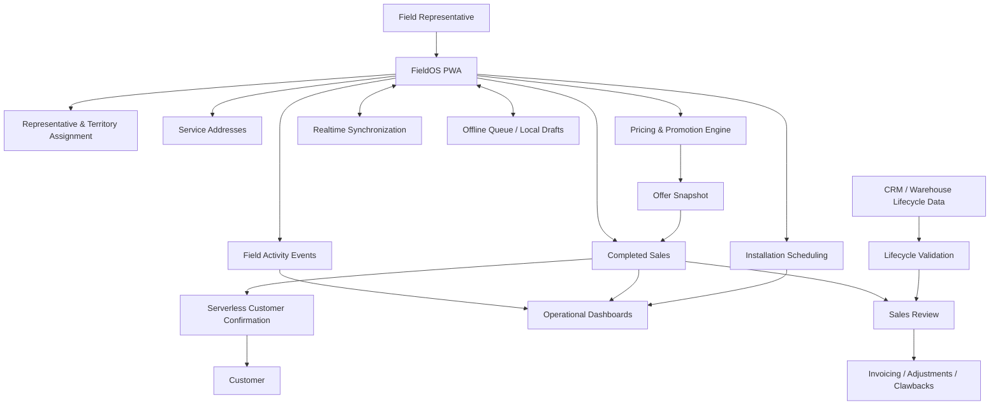
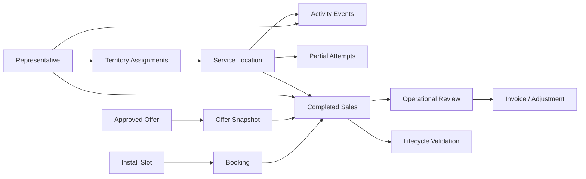

# FieldOS

## Field Sales Operations & Intelligence Platform

**FieldOS** is a production field-sales operating system I designed and built to connect serviceable address data, door-to-door activity, territory execution, dynamic pricing, installation scheduling, post-sale operations, invoicing, and management intelligence in one address-centered workflow.

The system was created for real field use. Representatives work from mobile devices in areas where connectivity may be unreliable, while operations and management need a trustworthy view of what happened at each service location after the representative leaves the door.

> **Public showcase notice**  
> The production application and source repository are private because they contain proprietary business logic, customer and operational data, production infrastructure, pricing configuration, credentials, vendor information, and internal integrations. This repository is a sanitized portfolio representation of the system architecture and engineering patterns.

---

## Project Context

| Item | Detail |
|---|---|
| Development began | February 2026 |
| Current state | Production system under ongoing development |
| Public showcase | August 2026 |
| Primary use case | Broadband field sales and post-sale operations |
| Front end | HTML, CSS, vanilla JavaScript |
| Operational data layer | PostgreSQL / Supabase |
| Realtime | Supabase Realtime with reconciliation fallback |
| Production runtime | Vercel |
| Mapping | Leaflet / geospatial service-location data |
| Reporting | Operational dashboards and Chart.js visualizations |
| Email | Server-side SMTP through a Vercel function |
| Mobile resilience | PWA caching, browser storage, offline queue, safe update coordination |

The public commit history reflects the showcase repository, not the full history of the private production system.

---

## Why I Built It

The original field-sales process crossed several disconnected operational areas:

- serviceable addresses,
- territory assignments,
- field canvassing,
- customer dispositions,
- sales capture,
- promotion rules,
- installation capacity,
- post-sale review,
- invoicing,
- disconnect/clawback handling,
- vendor reporting,
- management reporting,
- downstream CRM/work-order data.

A field representative needed a fast way to answer **“Which addresses should I work and what can I sell here?”** Operations needed to answer **“Which sales need action?”** Management needed to answer **“What is actually happening by territory, team, representative, and lifecycle state?”**

FieldOS turns those questions into one connected workflow instead of requiring people to reconcile multiple spreadsheets, maps, emails, and database exports manually.

---

## End-to-End Workflow

```text
Serviceable Location
        ↓
Territory / Representative Assignment
        ↓
Field Map & Address History
        ↓
Door Interaction / Disposition
        ↓
Customer Information & Approved Offer
        ↓
Installation Capacity Check
        ↓
Transactional Sale Submission
        ↓
Saved Pricing Snapshot
        ↓
Customer Confirmation
        ↓
Sales Review / Installation Outcome
        ↓
Invoice / Adjustment / Clawback Workflow
        ↓
Lifecycle Validation & Management Reporting
```

The **service address and external location identifier** are the operational anchors. Field activity, sales, scheduling, review, and downstream lifecycle matching remain traceable to the same service location wherever possible.

---

# Architecture



### Architectural principles

1. **The address is the operational anchor.** Every interaction should remain traceable to a service location.
2. **Pricing is data-driven.** Approved offers are configuration, not scattered hard-coded text.
3. **A sale preserves what the customer was quoted.** The submitted order stores an `offer_snapshot` so future pricing changes do not rewrite historical sales.
4. **Installation capacity is shared state.** A slot is only truly available when the database confirms it.
5. **Field work must survive weak connectivity.** Connectivity failures can be queued; validation and permission failures remain visible errors.
6. **Completed sales are transactional.** Order, booking, and activity state are treated as one logical operation.
7. **Realtime is an accelerator, not the sole source of truth.** Realtime events are paired with database reconciliation and polling fallback.
8. **Partial opportunities are not completed sales.** Incomplete customer interactions are captured separately so reporting and invoicing remain accurate.
9. **Customer communications use persisted order data.** Confirmation emails derive promotion details from the saved sale snapshot.
10. **External lifecycle data is validated before it controls financial state.** CRM/warehouse feeds are compared first; automatic write-back is a later controlled phase.
11. **Deployments must protect unsynced field work.** PWA updates are coordinated across build markers and deferred when local work is pending.

For a deeper system-level description, see [`docs/architecture.md`](docs/architecture.md).

---

# What FieldOS Handles

### Field execution

- Representative launch and assignment lookup
- Territory-based address loading
- Interactive address-level mapping
- Territory boundary visualization
- Address dispositions and field-history tracking
- Follow-up identification
- Customer information capture
- Partial-sale autosave
- Package/promotion selection
- Installation-slot selection
- Sale submission
- Offline work preservation

### Operations

- Submitted-sale review
- Installation outcome tracking
- Cancellation and reschedule handling
- Invoice-ready identification
- Invoice/export workflows
- Adjustment and clawback workflows
- Capacity monitoring
- Data-quality review
- Operational audit history

### Management

- Company-wide sales visibility
- Team, territory, and representative performance
- Door activity and close-rate analysis
- Install completion reporting
- Capacity utilization
- Estimated revenue metrics
- Follow-up opportunities
- Historical campaign comparisons
- Executive summaries

### Platform administration

- Representative management
- Territory assignment
- Territory activation/deactivation
- Pricing/promotion administration
- Map boundary management
- Schedule capacity configuration
- Dashboard access controls
- Reporting configuration
- Data-quality tooling

---

# Platform Showcase

The screenshots below are sanitized examples from the production system. Customer information and sensitive operational details have been removed or obscured.

## Company Sales Dashboard

The Company Sales Dashboard brings sales, field activity, installation state, follow-up opportunities, and representative performance into one operational view.

**Highlights**

- Company/team/territory filtering
- Submitted and installed sales
- Door activity and close rate
- Installation availability
- Representative performance
- Recent activity and status review
- Route and field-activity visibility


---

## Installation Schedule Availability

Installation capacity is shared operational state. FieldOS shows availability by territory, date, and appointment window while reconciling capacity against existing bookings.

**Highlights**

- Territory-level capacity
- Booked vs. available slots
- Multi-day scheduling
- Realtime refresh
- Polling/reconciliation fallback
- Database-confirmed booking results
- Overbooking prevention


---

## Sales Review & Invoicing

Sales Review gives operations a controlled post-sale workflow instead of requiring direct database edits.

**Highlights**

- Centralized review queue
- Order-entry tracking
- Installation outcomes
- Invoice-ready identification
- Invoice/export workflow
- Cancellation and rescheduling
- Adjustment/clawback handling
- Lifecycle validation visibility


---

## Executive Command Center

The management view aggregates operational records into business-level reporting across sales, installations, field activity, capacity, and team performance.

**Highlights**

- Executive KPIs
- Submitted vs. installed sales
- Field activity and close rate
- Team and territory comparisons
- Installation capacity
- Follow-up opportunity visibility
- Trend analysis
- Historical comparisons


---

## Interactive Territory Map

Representatives work from an address-level map within their assigned territories. Markers reflect prior field activity and support direct entry into the current address workflow.

**Highlights**

- Service-location map
- Territory boundaries
- Address dispositions
- Prior interaction visibility
- Follow-up identification
- Sales/status indicators
- Territory-scoped access


---

## Representative Sale Workflow

The field-sale interface combines customer capture, approved package selection, pricing, installation scheduling, and outcome tracking in one mobile-oriented workflow.

Pricing is loaded from the central offer configuration and preserved with the completed sale so the customer confirmation can reference the same offer the representative used.


---

# Selected Engineering Challenges

## 1. Transactional Sale Submission

A completed sale affects multiple pieces of operational state:

```text
Customer Order
     +
Installation Reservation
     +
Address Activity Event
```

Allowing the browser to create those independently creates partial-success failure modes: an order without an appointment, a booking without an order, or duplicate activity after a retry.

The production workflow therefore uses a controlled database transaction/RPC path. A client-generated submission identifier allows safe retry behavior, and the database response is treated as the authoritative result.

See [`examples/transactional-sale-client.js`](examples/transactional-sale-client.js).

---

## 2. Offline Field Operations & Reconciliation

Door-to-door work happens in weak cellular coverage. A connectivity interruption cannot be allowed to erase a representative's work or encourage duplicate submissions.

FieldOS distinguishes between:

**Connectivity failures**

- eligible for local queueing,
- retried after reconnect,
- visible as pending sync.

**Validation / permission / schema failures**

- surfaced as real errors,
- not mislabeled as offline saves,
- require correction rather than blind replay.

Queued activity is replayed sequentially, then the app re-reads authoritative database state.

See [`examples/offline-sync-queue.js`](examples/offline-sync-queue.js).

---

## 3. Shared Installation Capacity & Realtime Concurrency

Two representatives can view the same appointment window at the same time. The browser's last-rendered slot count is therefore not enough to guarantee availability.

FieldOS combines:

- shared capacity records,
- transactional booking validation,
- Supabase Realtime change events,
- debounced refreshes,
- polling fallback,
- focus/reconnect reconciliation.

Realtime makes the UI responsive; the database remains authoritative.

See [`examples/realtime-schedule-sync.js`](examples/realtime-schedule-sync.js).

---

## 4. Data-Driven Pricing & Immutable Offer Snapshots

Promotions can vary by territory, team, package, active dates, and promotional phase. Equipment can also have its own phase schedule—for example, included during a promotion and billed afterward.

Rather than duplicating promotion language across forms and emails, FieldOS loads an approved offer definition and normalizes it into one pricing model.

When the sale is completed, the system saves a snapshot containing concepts such as:

- package name,
- speed,
- promotion display,
- promotion term,
- standard rate,
- internet phases,
- recurring/equipment charges,
- estimated promotional total,
- first-bill estimate,
- customer disclosure.

That snapshot is historical evidence of what was quoted at the time of sale.

```text
Approved Offer
     ↓
Representative Price Breakdown
     ↓
Saved offer_snapshot
     ↓
Customer Confirmation
```

See [`examples/pricing-offer-snapshot.js`](examples/pricing-offer-snapshot.js).

---

## 5. Partial Sale Capture Without Polluting Completed Sales

A representative may collect useful information before the customer declines or the interaction stops. Discarding the information loses follow-up value; storing it as a sale corrupts reporting.

FieldOS separates the lifecycle:

```text
Interaction Starts
       ↓
Local Draft / Partial Attempt
      / \
     /   \
No Sale   Completed Sale
  ↓            ↓
Abandoned    Converted
```

Partial records can preserve the furthest step reached while remaining excluded from sales totals, booking capacity, invoicing, and vendor-payment counts.

See [`examples/partial-sale-capture.js`](examples/partial-sale-capture.js).

---

## 6. Idempotent Customer Communications

Database webhooks may retry. Sending an email directly on every webhook delivery risks duplicate customer confirmations.

The server-side flow reserves the confirmation first:

```text
pending → sending → sent
                  ↘ failed
pending → skipped
```

Only the request that successfully transitions `pending` to `sending` is allowed to contact the mail server. The email then uses the persisted sale's pricing snapshot rather than reconstructing the promotion independently.

See [`examples/sale-confirmation-webhook.js`](examples/sale-confirmation-webhook.js).

---

## 7. Safe PWA Updates in a Field Environment

A browser-based field application can remain open for hours or days. Service-worker caching creates another reliability problem: a partial deployment can leave the HTML, JavaScript, service worker, and required-build marker on different versions.

FieldOS coordinates the release using synchronized build markers and includes a reload guard so a partial deployment cannot trap the user in an infinite refresh loop.

Updates are also deferred when unsynced work exists.

```text
New Build Detected
       ↓
Pending Local Work?
   /             \
 Yes             No
  ↓               ↓
Defer          Reload Once
                  ↓
            Build Matches?
             /        \
           Yes        No
            ↓          ↓
          Done      Guard / Retry
```

See [`examples/pwa-update-coordinator.js`](examples/pwa-update-coordinator.js).

---

## 8. Downstream CRM / Warehouse Lifecycle Validation

A completed field sale eventually has downstream account, work-order, installation, disconnect, and financial states. Those systems can affect invoice eligibility and clawback decisions, so external data should not blindly overwrite FieldOS.

FieldOS uses an external location identifier to correlate the service location and compares expected vs. observed lifecycle state.

```text
FieldOS Sale
     ↓
External Location ID
     ↓
CRM / Work Order / Warehouse Feed
     ↓
Validation Layer
     ↓
Match / Mismatch / Exception / Review
```

The current architecture is deliberately **validation-first**. Controlled automatic write-back is a future phase after the relationship and exception rules are proven reliable.

See [`examples/lifecycle-validation.sql`](examples/lifecycle-validation.sql).

---

# Data Architecture

The production system uses PostgreSQL/Supabase as the operational source of truth. The public showcase intentionally uses conceptual entity names rather than publishing the complete private schema.



The key design choice is to preserve **events and lifecycle records** instead of overwriting all history into one status field. A sale, an installation outcome, and a later clawback are different business facts and should remain independently auditable.

---

# Access & Security Model

The public showcase intentionally avoids implying a single authentication mechanism across every surface.

### Representative-facing field app

The field launch flow is optimized for speed and assignment lookup. An active representative identity is matched to configured territory assignments, and the browser operates with intentionally limited client permissions.

### Administrative / management surfaces

Administrative and management workflows use authenticated sessions and application/database authorization rules.

### Browser-safe vs. server-only credentials

Browser code may contain only public client configuration appropriate for the platform's Row Level Security and grants. Privileged credentials—service-role access, SMTP credentials, webhook secrets, and other sensitive integration keys—remain server-side.

### Public showcase policy

This repository does **not** include:

- customer names or contact information,
- real serviceable-address universes,
- production secrets,
- internal endpoints,
- exact vendor configuration,
- unredacted operational exports,
- full production database schema,
- proprietary pricing records.

---

# Technology Stack

| Layer | Technology / Pattern | Responsibility |
|---|---|---|
| Field UI | HTML, CSS, vanilla JavaScript | Mobile field workflow, maps, forms, pricing, scheduling |
| Operational UI | HTML, CSS, JavaScript | Dashboards, review queues, management/admin tooling |
| Database | PostgreSQL | Transactional and operational state |
| Managed data services | Supabase | PostgreSQL access, Realtime, authentication services |
| Database logic | SQL / PL/pgSQL / RPC | Controlled multi-record operations and reporting logic |
| Realtime | Supabase Realtime | Fast cross-device change propagation |
| Resilience | Browser storage + service worker | Offline queue, local drafts, PWA caching |
| Mapping | Leaflet / geospatial coordinates | Service-location and territory visualization |
| Reporting | Chart.js + operational queries | KPI and trend visualization |
| Server runtime | Node.js / Vercel Serverless Functions | Privileged integration workflows |
| Customer email | Nodemailer / SMTP | Transactional confirmations |
| Integration pattern | REST/webhooks/warehouse validation | External system communication and reconciliation |

The production front end is intentionally lightweight: primarily vanilla JavaScript, with shared correctness pushed into PostgreSQL/RPC logic and trusted server-side workflows where appropriate.

---

# Repository Structure

```text
fieldos-project-showcase/
│
├── README.md
├── docs/
│   ├── architecture.md
│   └── technical-overview.md
│
├── examples/
│   ├── README.md
│   ├── transactional-sale-client.js
│   ├── offline-sync-queue.js
│   ├── realtime-schedule-sync.js
│   ├── pricing-offer-snapshot.js
│   ├── partial-sale-capture.js
│   ├── sale-confirmation-webhook.js
│   ├── pwa-update-coordinator.js
│   ├── lifecycle-validation.sql
│   └── schedule-reconciliation-audit.sql
│
└── images/
    ├── 01_company_sales_dashboard.png
    ├── 02_install_schedule_availability.png
    ├── 03_sales_review_invoicing.png
    ├── 04_executive_command_center.png
    ├── 06_territory_map.png
    └── 08_sales_form_example.png
```

The code examples are simplified and sanitized implementation patterns. They are intended to demonstrate engineering decisions, not recreate the private production application.

---

# Deeper Documentation

- [`docs/architecture.md`](docs/architecture.md) — system boundaries, data flows, access model, failure handling, and lifecycle design.
- [`docs/technical-overview.md`](docs/technical-overview.md) — implementation-oriented walkthrough of the production architecture and engineering decisions.
- [`examples/README.md`](examples/README.md) — guide to the sanitized code and SQL examples.

---

# What This Project Demonstrates

FieldOS required work across both software engineering and operational system design:

- translating business workflows into durable data models,
- designing mobile-first field interfaces,
- geospatial/address-centered workflows,
- transactional consistency,
- idempotency,
- shared-resource concurrency,
- offline resilience,
- Realtime synchronization,
- PWA deployment/version safety,
- dynamic pricing configuration,
- immutable historical snapshots,
- lifecycle/state-machine design,
- webhook and SMTP integration,
- PostgreSQL/SQL design,
- data-quality safeguards,
- operational reporting,
- financial workflow support,
- external-system reconciliation,
- progressive automation rather than unsafe write-back.

The part I consider most important is that the application is not just a collection of screens. It is a connected operating model in which the same service location can be followed from **field activity → customer decision → sale → installation → financial review → downstream lifecycle**.

---

## Status

FieldOS remains an actively developed private production system. This public repository is maintained as a technical showcase and may evolve as additional production capabilities are appropriate to describe publicly.
