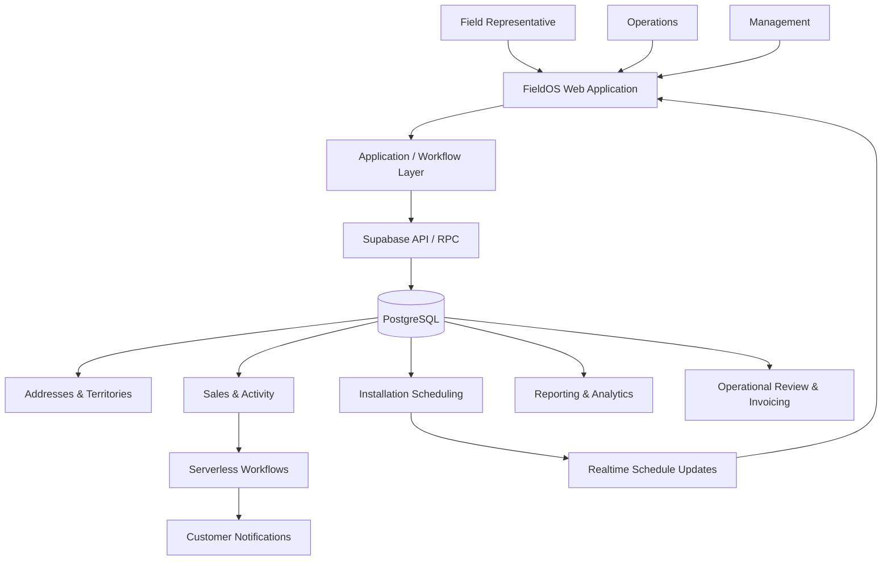
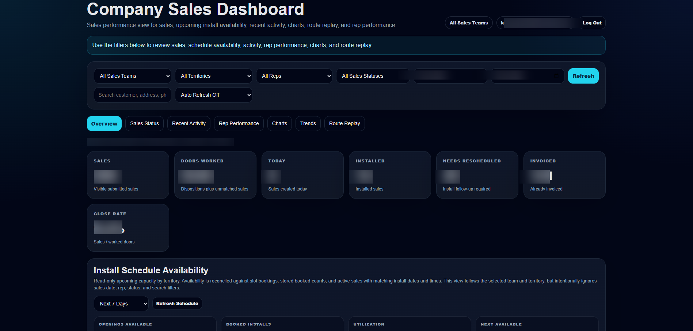
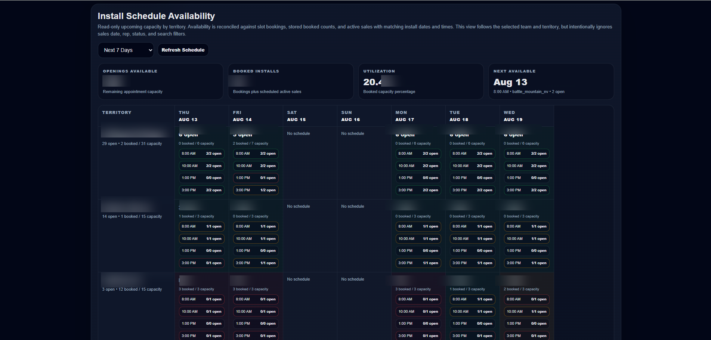
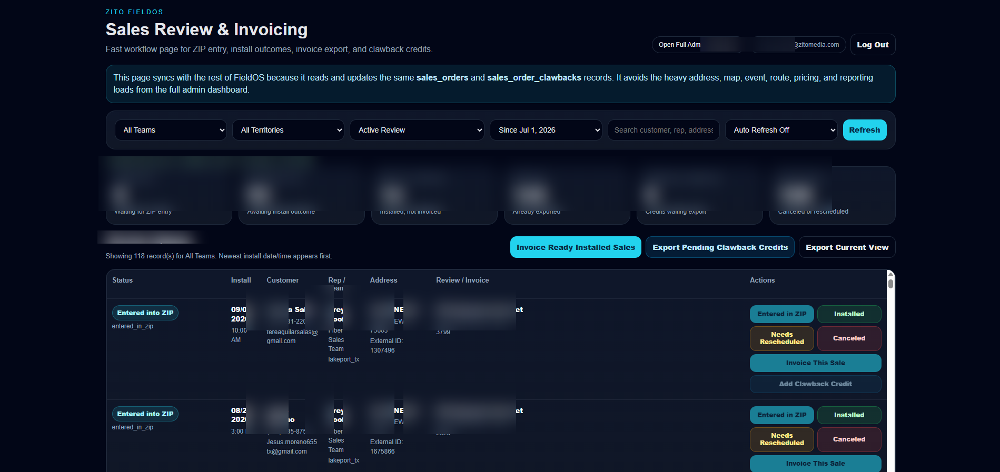
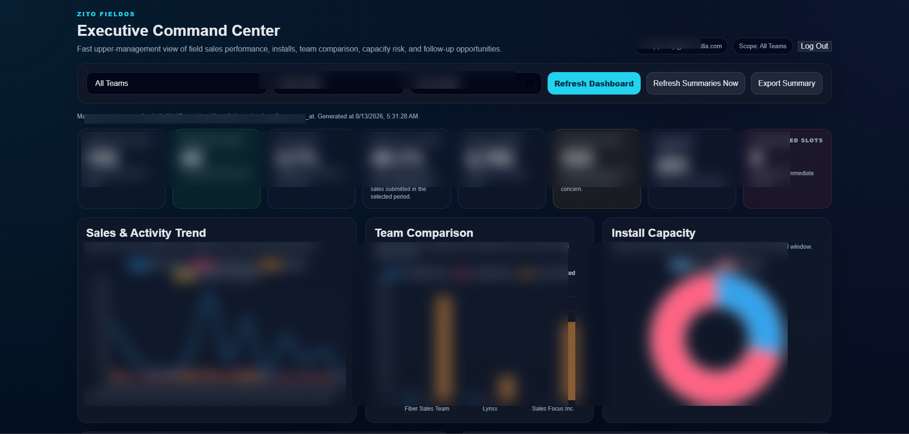
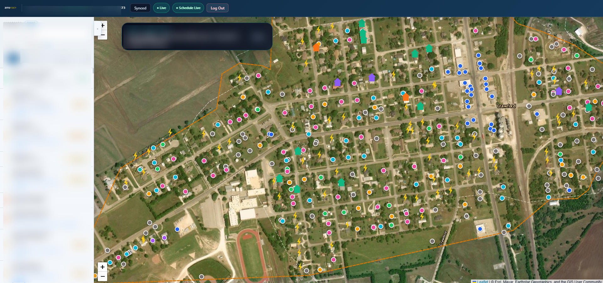
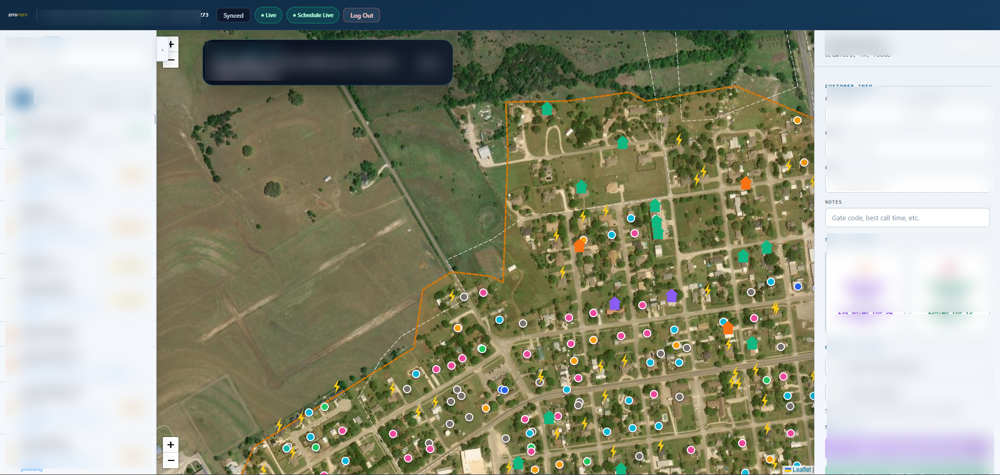

# Field Sales Operations Platform

A field-sales operations platform I designed and built to bring territory management, address-level canvassing, sales, installation scheduling, invoicing, reporting, and management oversight into one system.

FieldOS was created for real field and operational use. It supports representatives working from mobile devices while also giving operations and management a centralized view of sales activity, installation capacity, territory performance, and field activity.

> The production application and source repository are maintained privately because they contain proprietary business logic, internal infrastructure, customer and operational data, pricing rules, integrations, and company-specific workflows.

---

## Project Context

**Development began:** February 2026  
**Status:** Production system under ongoing development  
**Public showcase:** August 2026

This repository is a sanitized portfolio representation of a privately maintained production system. The public commit history reflects the creation and maintenance of this showcase, not the full development history of the production application.

---

## Overview

The project started with a fragmented field-sales process.

Representatives needed a practical way to work assigned addresses, record outcomes, submit sales, and schedule installations while in the field. Operations needed visibility into those sales after submission. Management needed reporting across representatives, territories, vendors, installations, and overall field performance.

Instead of continuing to connect those processes manually, I built FieldOS as a centralized operating platform.

At a high level:

```text
Serviceable Address Data
        ↓
Territory Assignment
        ↓
Representative Field Map
        ↓
Address Activity / Disposition
        ↓
Sale Submission
        ↓
Installation Scheduling
        ↓
Operations Review
        ↓
Installation Outcome / Invoicing
        ↓
Management Reporting & Analytics
```

The application connects the field workflow with the operational processes that happen after the representative leaves the door.

---

## What the Platform Handles

FieldOS includes workflows for:

- Address-level canvassing
- Interactive territory mapping
- Territory assignments
- Door disposition tracking
- Sales submission
- Installation scheduling
- Installation-capacity management
- Representative management
- Vendor and team management
- Follow-up tracking
- Sales review
- Installation outcome tracking
- Rescheduling and cancellation workflows
- Invoicing workflows
- Historical activity tracking
- Automated customer communications
- Operational reporting
- Management analytics
- Data-quality controls
- Role-based administrative access

---

## Technology

The platform includes work across:

- TypeScript
- JavaScript
- PostgreSQL
- SQL / PL/pgSQL
- Supabase
- Vercel
- REST APIs
- Supabase Realtime
- Serverless API handlers
- HTML / CSS
- Browser storage and offline synchronization
- Geospatial and address-level data

---

## Core Architecture



The database acts as the authoritative source for operational state while the application provides separate workflows for representatives, operations staff, and management.

---

# Platform Showcase

The screenshots below highlight several parts of FieldOS, from the representative field workflow through operations and executive reporting.

> Customer information and sensitive operational data have been removed or obscured for this public portfolio.

---

## Company Sales Dashboard

The Company Sales Dashboard provides a centralized view of field-sales activity across teams, territories, and representatives.

Management can review sales performance, field activity, installation status, follow-up opportunities, and representative performance from one interface.

**Highlights:**

- Sales and field-activity tracking
- Territory and representative filtering
- Sales-status monitoring
- Close-rate reporting
- Installation availability
- Recent activity
- Representative performance
- Route and field-activity review



---

## Installation Schedule Availability

The scheduling interface provides visibility into installation capacity by territory, date, and appointment window.

Availability is reconciled against existing bookings so representatives can see which installation windows are still available while they are completing a sale.

**Highlights:**

- Territory-level installation capacity
- Appointment-slot availability
- Booked vs. available capacity
- Multi-day scheduling
- Capacity utilization
- Real-time schedule updates
- Overbooking prevention



---

## Sales Review & Invoicing

The Sales Review & Invoicing interface gives operations staff a dedicated workflow for managing submitted sales after the initial field interaction.

Sales can move through installation, invoicing, cancellation, rescheduling, and adjustment workflows without requiring staff to work directly with the underlying database.

**Highlights:**

- Centralized sales-review queue
- Installation-outcome tracking
- Invoice-ready sales identification
- Invoice export workflows
- Cancellation tracking
- Rescheduling
- Adjustment and clawback workflows
- Team and territory filtering



---

## Executive Command Center

The Executive Command Center provides leadership with a higher-level view of field-sales performance and operational health.

It combines sales, installations, field activity, capacity, follow-up opportunities, and team comparisons into one management reporting interface.

**Highlights:**

- Executive KPI reporting
- Submitted vs. installed sales
- Field activity and close-rate analysis
- Team-performance comparisons
- Installation-capacity monitoring
- Follow-up opportunity identification
- Trend visualization
- Management summary reporting



---

## Interactive Territory Map

Field representatives work from an interactive map containing serviceable addresses within their assigned territories.

Address-level markers give representatives visibility into previous activity, current status, follow-up opportunities, and sales history while they are working in the field.

**Highlights:**

- Address-level territory mapping
- Territory-boundary visualization
- Address-disposition tracking
- Previous field-activity visibility
- Follow-up identification
- Sales and customer-status indicators
- Territory-based representative access



---

## Address & Sales Workflow

Representatives can open an address directly from the territory map and complete the sales workflow without leaving the field interface.

The system brings customer information, package selection, sales outcomes, and installation scheduling into one workflow.

**Highlights:**

- Address-specific sales workflow
- Customer-information capture
- Market-specific package availability
- Sales-outcome tracking
- Installation appointment selection
- Real-time schedule availability
- Direct sale submission from the field



---

# Selected Engineering Challenges

FieldOS needed to work in conditions that are different from a typical office-based web application.

Representatives may be working from phones in areas with inconsistent cellular service, while multiple users can be viewing or changing installation availability at the same time.

That led to several design decisions around reliability and data integrity.

---

## Transactional Sale Submission

A completed sale affects several related parts of the system.

Conceptually:

```text
Sale Submission
      ↓
Order
      +
Installation Booking
      +
Field Activity Event
```

Rather than allowing the browser to independently create each record, the application can send the complete workflow to a database transaction.

This keeps related records consistent and allows the database to remain the authoritative source of the result.

A client-generated submission identifier also allows retries to be handled without unintentionally creating duplicate sales.

---

## Offline Field Work

Field representatives cannot always depend on stable connectivity.

When a database operation cannot be completed because the device has lost connectivity, the application can preserve the work locally instead of forcing the representative to start over.

```text
Field Action
    ↓
Network Available?
   /         \
 Yes          No
  ↓            ↓
Database    Local Queue
               ↓
        Connectivity Returns
               ↓
          Replay Operation
               ↓
            Database
```

This makes the workflow more practical for mobile field use.

---

## Real-Time Installation Availability

Installation capacity can change while multiple representatives are working.

Supabase Realtime is used to help propagate database changes to active devices.

The application also keeps a lightweight polling fallback because mobile browsers, cellular connections, and WebSocket sessions are not always reliable.

```text
Database Change
      ↓
Realtime Event
      ↓
Refresh Schedule

        +

Periodic Reconciliation
      ↓
Database
      ↓
Refresh Schedule
```

The database remains the source of truth rather than depending entirely on the browser's local view of capacity.

---

## Transactional Customer Notifications

A successful order can trigger a customer confirmation workflow.

Database webhook events may occasionally be retried or delivered more than once, so the notification workflow uses a conditional state transition before sending the message.

```text
Order Created
      ↓
Database Webhook
      ↓
Notification Pending?
      ↓
Reserve Notification
      ↓
Send Email
      ↓
Record Delivery Status
```

Only the process that successfully reserves the notification can continue with delivery.

---

## External Schedule Reconciliation

External scheduling information can be useful without giving an outside source direct control over live installation capacity.

The reconciliation workflow can first record what the external source **would** change:

```text
External Schedule
        ↓
Normalize Data
        ↓
Compare With FieldOS
        ↓
Audit Result
        ↓
Review / Validation
```

This creates an audit layer between external data and live scheduling operations.

---

# Implementation Examples

The full production application remains private, but this repository includes sanitized code examples based on implementation patterns used in FieldOS.

These examples demonstrate the engineering approach without exposing production schemas, credentials, customer information, pricing rules, territory configuration, vendor information, or proprietary business logic.

---

## Transactional Sale Submission

**[View `transactional-sale-client.js` →](examples/transactional-sale-client.js)**

A simplified client-side example showing how a sale can be submitted as one transactional workflow.

**Demonstrates:**

- Supabase RPC calls
- Transactional workflows
- Client-generated submission IDs
- Idempotent retries
- Transaction-response validation
- Connectivity-aware submission handling
- Schedule reconciliation

---

## Offline Synchronization Queue

**[View `offline-sync-queue.js` →](examples/offline-sync-queue.js)**

A browser-side queue pattern for preserving field activity when connectivity is unavailable and replaying it when the device reconnects.

**Demonstrates:**

- Offline-first workflow design
- Browser local storage
- Sequential task replay
- Retry metadata
- RPC synchronization
- Connectivity detection
- Failure preservation

---

## Real-Time Schedule Synchronization

**[View `realtime-schedule-sync.js` →](examples/realtime-schedule-sync.js)**

A simplified example of keeping installation availability current across devices while accounting for missed WebSocket events and unstable mobile connections.

**Demonstrates:**

- Supabase Realtime
- PostgreSQL change subscriptions
- Debounced refreshes
- Polling fallback
- Browser visibility checks
- Online/offline handling
- Serialized refresh operations
- Database reconciliation

---

## Customer Confirmation Webhook

**[View `sale-confirmation-webhook.js` →](examples/sale-confirmation-webhook.js)**

A server-side notification pattern that reserves the notification state before sending so duplicate webhook events do not create duplicate customer messages.

**Demonstrates:**

- Serverless API handlers
- Database webhooks
- Secret validation
- Environment-based configuration
- Conditional database updates
- Duplicate-send prevention
- SMTP delivery
- Delivery-state tracking

---

## Schedule Reconciliation Audit

**[View `schedule-reconciliation-audit.sql` →](examples/schedule-reconciliation-audit.sql)**

A PostgreSQL example showing how external scheduling information can be audited before being allowed to affect live scheduling.

**Demonstrates:**

- PostgreSQL schema design
- SQL constraints
- Unique source identifiers
- JSONB
- Indexing
- Row Level Security
- Service-role permissions
- Controlled workflow states
- Audit-first integration design

---

### More About the Examples

**[View the Implementation Examples README →](examples/README.md)**

The examples README explains how the individual code samples relate to the larger production architecture.

---

# Technical Documentation

For a deeper look at the system:

- **[System Architecture →](docs/architecture.md)**  
  Application architecture, data domains, user roles, integrations, security, and end-to-end system design.

- **[Technical Overview →](docs/technical-overview.md)**  
  Implementation details covering the technology stack, database design, scheduling concurrency, sales workflows, APIs, reporting, testing, deployment, and engineering decisions.

- **[Implementation Examples →](examples/README.md)**  
  Sanitized examples covering transactional sales, offline synchronization, real-time scheduling, customer notifications, and PostgreSQL integration design.

---

# My Role

I designed and developed FieldOS from the initial business requirements through production deployment and ongoing operation.

My work included:

- Identifying and mapping the original business processes
- Application architecture
- Workflow design
- Database architecture
- Front-end development
- Back-end development
- SQL and PL/pgSQL
- API integrations
- Address and territory workflows
- Interactive mapping
- Scheduling and capacity logic
- Transactional sales workflows
- Offline synchronization
- Real-time data synchronization
- Customer-notification automation
- Sales review and invoicing workflows
- Reporting and analytics
- Administrative tooling
- Data-quality controls
- Testing
- Deployment
- Production troubleshooting
- Ongoing feature development and support

The project required me to work across both the business and technical sides of the system: understanding how field sales and operations actually work, translating those processes into software, and continuing to improve the platform as new operational needs emerged.

---

# Source Code & Production Data

The complete FieldOS production repository remains private because it contains:

- Proprietary company workflows
- Customer and operational information
- Internal address and territory data
- Pricing and package rules
- Vendor configuration
- Infrastructure configuration
- Credentials and integrations
- Production database schemas
- Company-specific business logic

This public repository is a sanitized portfolio representation of the system.

The screenshots, documentation, architecture, and implementation examples are intended to show what I built, the problems it solves, and the engineering approach behind it without exposing the production environment.

---

## Summary

FieldOS connects the complete field-sales workflow:

```text
Territories & Addresses
        ↓
Field Representatives
        ↓
Door Activity
        ↓
Sales
        ↓
Installation Scheduling
        ↓
Operations Review
        ↓
Installation Outcomes
        ↓
Invoicing
        ↓
Reporting & Analytics
```

What started as a need to better organize field-sales activity grew into a broader operational platform connecting representatives, scheduling, sales, operations, data, and management reporting in one system.
