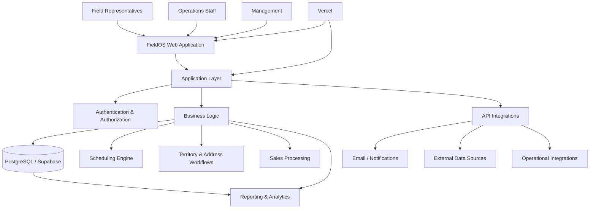
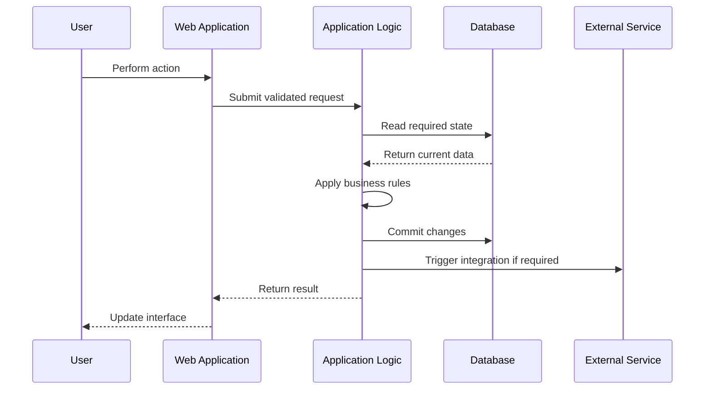
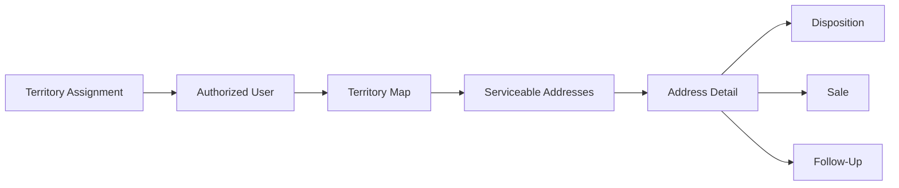
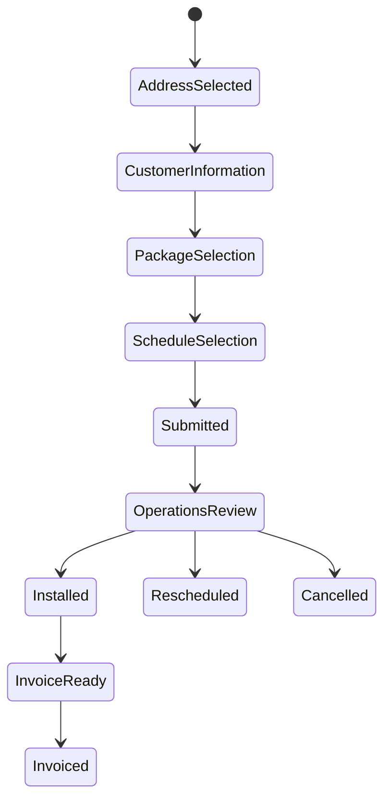
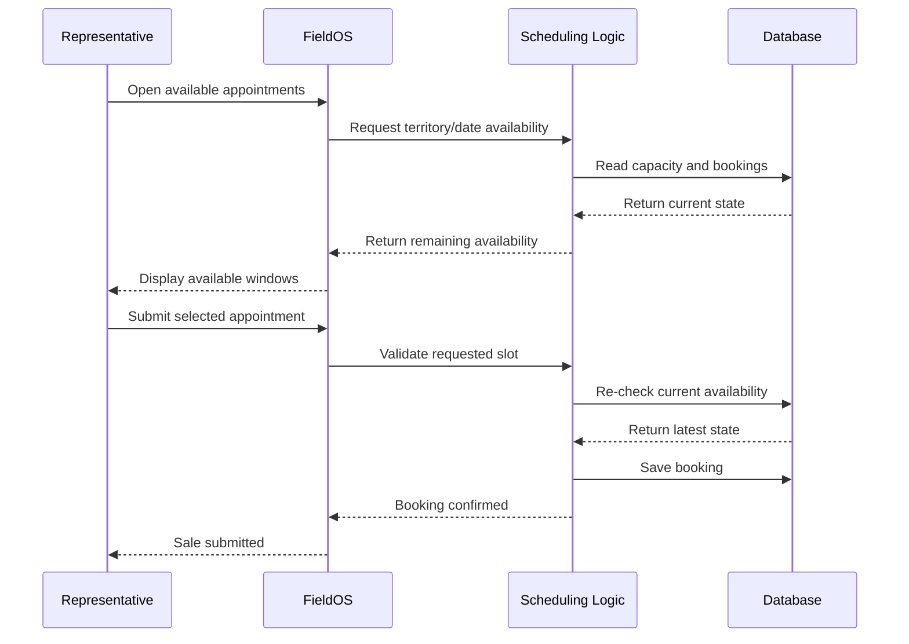
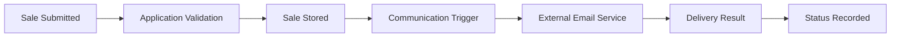
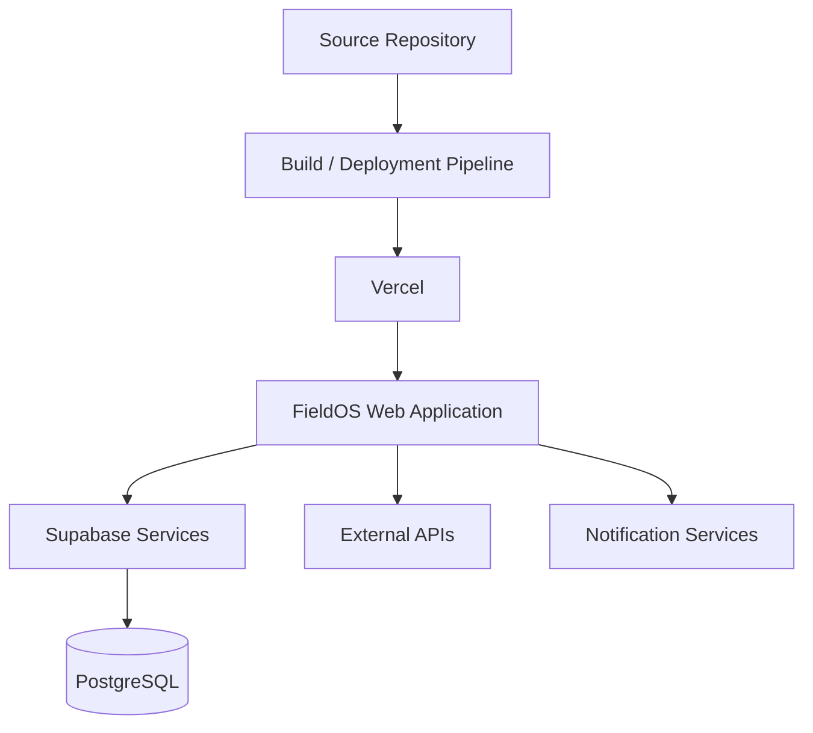
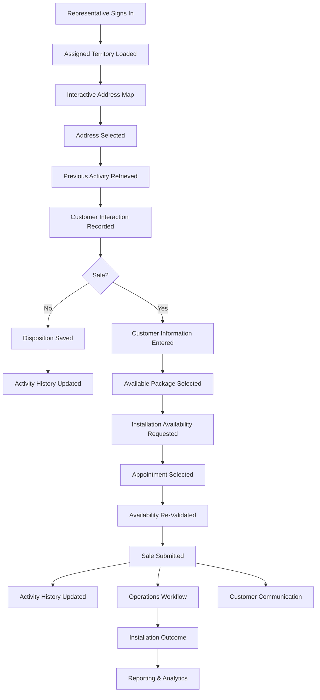

# FieldOS System Architecture

## Purpose

FieldOS is a cloud-based field sales operations platform designed to connect the work performed by field representatives with the operational processes required after a customer interaction.

The system brings territory management, address-level canvassing, sales submission, installation scheduling, operational review, reporting, and management visibility into a single application.

This document provides a high-level technical overview of the platform architecture. Production implementation details, credentials, internal endpoints, proprietary business rules, and sensitive infrastructure configuration are intentionally excluded.

---

## Architecture Overview

FieldOS follows a modern web application architecture built around a browser-based client, application services, a PostgreSQL data layer, authentication, automated workflows, and third-party integrations.



At a high level, the application consists of:

- A web-based interface for representatives, operations, and management
- A TypeScript / JavaScript application layer
- PostgreSQL for transactional and operational data
- Supabase for managed database and application services
- Vercel for application deployment and hosting
- API integrations for supporting workflows
- Automated processes for notifications, reporting, and operational synchronization

---

## User Roles

FieldOS is designed around multiple operational roles rather than a single universal interface.

### Field Representatives

Field representatives primarily interact with:

- Assigned territories
- Serviceable addresses
- Interactive maps
- Address dispositions
- Customer information
- Sales submissions
- Available installation appointments
- Follow-up opportunities

The representative workflow is intentionally optimized for field use so that common actions can be completed without moving between multiple systems.

### Operations

Operations users work with the post-sale lifecycle, including:

- Reviewing submitted sales
- Monitoring installation outcomes
- Managing reschedules and cancellations
- Reviewing appointment availability
- Preparing sales for invoicing
- Tracking exceptions and follow-up requirements
- Reviewing historical activity

### Management

Management interfaces focus on aggregated information such as:

- Sales performance
- Field activity
- Close rates
- Installation outcomes
- Territory performance
- Representative performance
- Vendor performance
- Operational capacity
- Historical trends
- Executive-level KPIs

### Administrators

Administrative functions provide controlled access to configuration and operational management tools such as:

- Representative access
- Territory assignments
- Vendor relationships
- Address imports
- Data quality review
- Reporting configuration
- Audit information

---

## Front-End Architecture

The FieldOS front end is a browser-based application built primarily with TypeScript and JavaScript.

The user interface is organized around operational workflows rather than individual database entities.

For example, a representative does not need to understand how address events, sales records, territory assignments, or scheduling data are stored. The application combines the required information into a single workflow.

### Main Interface Areas

The front end includes interfaces for:

- Authentication
- Company and team dashboards
- Interactive territory maps
- Address detail views
- Sales submission
- Installation scheduling
- Sales review
- Operational reporting
- Management reporting
- Administrative functions

### Design Approach

The front-end architecture emphasizes:

- Role-specific interfaces
- Reduced navigation during field workflows
- Immediate visibility into current address status
- Clear separation between representative and administrative tools
- Responsive views suitable for field use
- Centralized presentation of operational information

---

## Application Layer

The application layer sits between the user interface and the underlying data services.

Its responsibility is to translate user actions into controlled business operations.

Examples include:

- Recording an address disposition
- Submitting a sale
- Checking installation availability
- Reserving an installation slot
- Updating operational sale status
- Retrieving territory-specific addresses
- Building dashboard metrics
- Generating reporting views
- Triggering customer communications

This layer prevents the user interface from directly controlling sensitive business operations.



---

## Data Architecture

PostgreSQL serves as the primary operational data store.

The database is structured around several major business domains.

### Territory Domain

Stores information required to organize field activity geographically.

Conceptually this includes:

- Territories
- Territory boundaries
- Territory assignments
- Team or vendor relationships
- Territory configuration

### Address Domain

Addresses form the center of the field workflow.

Conceptually, an address can be associated with:

- Geographic coordinates
- Territory membership
- Serviceability information
- Current field disposition
- Historical activity
- Notes
- Sales activity
- Follow-up status

### Activity History

FieldOS separates historical activity from the current state of an address.

This allows the system to answer both:

> What is the current status of this address?

and:

> What has happened at this address over time?

Maintaining an event history supports:

- Auditability
- Rep activity reporting
- Historical analysis
- Follow-up workflows
- Operational troubleshooting

### Sales Domain

Sales records connect the field interaction with downstream operations.

Conceptually, a sale may include:

- Address
- Representative
- Territory
- Customer information
- Selected service
- Submission time
- Installation information
- Operational status
- Invoice status
- Cancellation or reschedule status

### Scheduling Domain

Scheduling data is kept separate from the sale itself so installation capacity can be managed as a shared operational resource.

The scheduling domain handles concepts such as:

- Territory
- Service date
- Appointment window
- Capacity
- Existing bookings
- Remaining availability

### User and Access Domain

User-related data supports:

- Authentication
- Role assignment
- Representative status
- Team membership
- Territory assignments
- Administrative permissions

---

## Territory and Mapping Architecture

Mapping is a core part of the representative workflow.

Rather than presenting representatives with a flat address list, FieldOS displays serviceable locations geographically within assigned territories.



### Address Markers

Map markers can represent operational information such as:

- Untouched addresses
- Previous contacts
- Not-home results
- Follow-up opportunities
- Completed sales
- Other field outcomes

This gives representatives situational awareness without requiring them to open each individual address.

### Territory Access

Territory access is controlled by assignment.

A representative's usable field data is determined by the territories available to that user rather than exposing the complete company address inventory.

This supports both usability and access control.

---

## Address Event Model

One architectural decision in FieldOS is to preserve activity as a history instead of simply overwriting an address each time something happens.

A simplified conceptual model looks like:

```text
Address
  |
  +-- Current Status
  |
  +-- Activity Event
  |     +-- Representative
  |     +-- Event Type
  |     +-- Timestamp
  |     +-- Notes / Metadata
  |
  +-- Activity Event
  |
  +-- Sale
```

This approach provides several benefits:

- The current address state remains fast to retrieve
- Historical activity remains available
- Management can analyze field behavior over time
- Disposition changes remain traceable
- Troubleshooting does not depend on the latest value alone

---

## Sales Workflow Architecture

The sales process begins from an address rather than from a standalone sales form.

This helps maintain a relationship between:

- Territory
- Address
- Representative
- Customer interaction
- Selected service
- Installation appointment
- Downstream operational status

A simplified lifecycle is:



The actual production workflow contains additional validation and operational states that are intentionally omitted from this public architecture document.

---

## Installation Scheduling Architecture

Scheduling is one of the more important shared-state problems in FieldOS.

Multiple representatives may be working simultaneously, while installation capacity is limited by:

- Territory
- Date
- Appointment window
- Operational capacity

The platform therefore treats appointment capacity as a controlled shared resource.

### Scheduling Flow



### Why Capacity Is Re-Checked

Displaying an available appointment is not enough.

Another representative may select the same window between the time availability is displayed and the time a sale is submitted.

For that reason, the system validates availability again during the submission process.

This reduces the risk of:

- Overbooking
- Stale availability
- Conflicting appointments
- Manual schedule correction

---

## Sales Review and Operational Processing

Once a representative submits a sale, responsibility transitions from the field workflow into the operational workflow.

The review layer allows operations staff to manage sales without modifying database records manually.

Common post-sale outcomes include:

- Pending installation
- Installed
- Rescheduled
- Cancelled
- Ready for invoicing
- Invoiced
- Additional review required

This provides a controlled operational lifecycle while keeping historical sales data intact.

---

## Reporting Architecture

FieldOS reporting is built on the same operational data created by normal application workflows.

This avoids requiring teams to maintain separate manual reporting datasets for basic field activity.

Reporting can combine:

- Address activity
- Sales
- Installations
- Territories
- Representatives
- Vendors
- Scheduling
- Operational outcomes

### Reporting Layers

The application provides multiple reporting perspectives.

#### Representative Level

Examples:

- Doors worked
- Sales submitted
- Close rates
- Follow-up activity

#### Territory Level

Examples:

- Field penetration
- Sales volume
- Address outcomes
- Installation performance

#### Team / Vendor Level

Examples:

- Team comparisons
- Vendor performance
- Sales outcomes
- Productivity

#### Executive Level

Examples:

- Overall sales
- Installed sales
- Field activity
- Operational capacity
- Performance trends
- Follow-up opportunities

---

## Authentication and Authorization

FieldOS uses authenticated access rather than exposing operational functionality publicly.

Authorization is designed around the principle that a user should only receive the tools and operational data required for that user's role.

Access decisions can depend on factors such as:

- User role
- Team
- Representative identity
- Territory assignment
- Administrative permission

### Role Separation

A field representative does not require the same access as an administrator.

Likewise, reporting users may require broad aggregated visibility without needing access to operational modification tools.

Separating these concerns reduces unnecessary exposure and simplifies each interface.

---

## API and Integration Layer

FieldOS uses APIs to connect internal application workflows with external services.

Integration categories include:

- Customer communications
- Operational notifications
- Reporting
- Scheduling-related workflows
- Data synchronization
- Supporting business systems

The application is designed so external service failures do not require representatives to understand or interact directly with those integrations.

Where appropriate, integration status can be stored so operations staff can identify whether an automated action completed successfully.

---

## Automated Customer Communications

Certain sales events can trigger customer-facing communications.

A simplified workflow is:



Keeping communication status associated with the operational workflow makes it possible to distinguish between:

- A successful sale submission
- A successful notification
- A notification requiring follow-up

---

## Data Imports and Data Quality

FieldOS also supports administrative data-loading workflows.

Imported data may require:

- Schema validation
- Territory association
- Address normalization
- Duplicate detection
- Geographic validation
- Data quality review

Import tooling is intentionally separated from normal field workflows so large administrative data changes are not performed through representative-facing interfaces.

---

## Auditability

Because FieldOS changes operational data used by multiple groups, traceability is an important architectural concern.

The platform preserves historical information for key activities so that operational questions can be investigated after the fact.

Examples include:

- Address activity history
- Status changes
- Administrative actions
- Sales lifecycle changes
- User-associated activity

This is particularly useful when reconciling field activity with sales, installations, or reporting.

---

## Deployment Architecture

The web application is deployed using Vercel.

Supabase provides managed PostgreSQL and supporting application services.

A simplified deployment model is:



The production source repository remains private.

Environment-specific configuration and secrets are stored outside the public showcase repository.

---

## Environment Configuration

Production systems require information that should never be committed to a public repository.

Examples include:

- Database credentials
- API keys
- Service tokens
- Private URLs
- Authentication secrets
- Environment-specific configuration

These values are managed through deployment environment configuration rather than being embedded directly in public source or documentation.

---

## Security and Privacy

FieldOS handles operational and customer-related information, so the architecture is designed with data exposure in mind.

Public portfolio materials intentionally exclude:

- Customer names
- Customer addresses
- Phone numbers
- Email addresses
- Account information
- Internal pricing rules
- Credentials
- API keys
- Internal service endpoints
- Proprietary company logic
- Production database schemas

Screenshots used in the public showcase have sensitive information removed or obscured.

---

## Reliability Considerations

Several parts of the application depend on shared or changing data.

Examples include:

- Installation availability
- Representative territory access
- Sale status
- Operational reporting
- External notifications

The architecture therefore favors validation against current server-side state rather than relying only on information previously loaded in the browser.

This is especially important for scheduling and sales submission, where stale client-side information could otherwise cause conflicting operational records.

---

## Architectural Principles

Several principles guide the design of FieldOS.

### 1. Build Around Workflows

The interface is organized around what users need to accomplish rather than mirroring database tables.

### 2. Maintain One Operational Source of Truth

Field activity, sales, scheduling, and reporting are connected through shared operational data rather than maintained as unrelated spreadsheets.

### 3. Preserve History

Important activity is retained so the platform can answer both current-state and historical questions.

### 4. Validate Shared Resources Server-Side

Resources such as appointment capacity are validated when an action is committed, not only when information is initially displayed.

### 5. Separate User Responsibilities

Representatives, operations, management, and administrators receive different interfaces and levels of access.

### 6. Keep Integrations Behind the Application Layer

Users interact with FieldOS rather than needing direct access to every external service.

### 7. Keep Sensitive Implementation Details Private

The public architecture explains the design and engineering approach without exposing production credentials, schemas, endpoints, or proprietary business rules.

---

## Example End-to-End Workflow

A representative sale demonstrates how several architecture components work together.



This workflow demonstrates how the platform connects field activity, scheduling, sales processing, customer communication, operations, and reporting without requiring the representative to work across separate systems.

---

## Public Documentation Scope

This architecture document is intentionally conceptual.

The public showcase is intended to demonstrate:

- System design
- Technical decision-making
- Workflow architecture
- Data modeling concepts
- Operational problem solving
- Application architecture
- Integration strategy

It intentionally does **not** provide enough detail to recreate or access the production system.

Production source code, database schemas, security policies, credentials, endpoints, deployment configuration, and proprietary business rules remain private.
