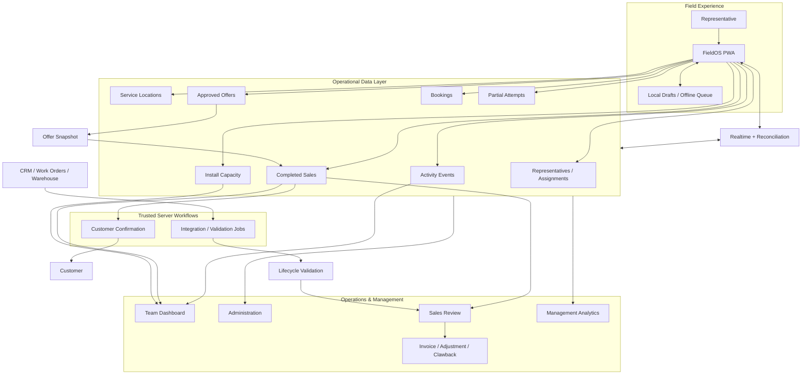
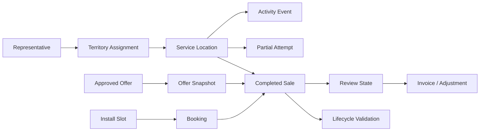
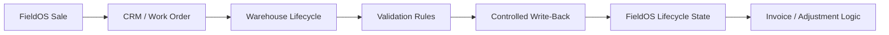

# FieldOS System Architecture

## Purpose

FieldOS is a browser-based field-sales operating system that connects representative activity at a service location with the operational workflows that follow: pricing, installation scheduling, customer communications, sales review, invoicing, management reporting, and downstream lifecycle validation.

This document describes the architecture at a public-showcase level. Production credentials, customer data, proprietary configuration, exact database schemas, internal endpoints, and vendor-specific rules are intentionally excluded.

---

# 1. Architectural Goals

FieldOS was designed around a set of operational guarantees rather than around a UI framework.

### Address-centered traceability

The service location should remain the stable anchor for:

- territory assignment,
- field activity,
- customer interaction history,
- partial sale attempts,
- completed sales,
- installation reservations,
- downstream lifecycle matching.

### Operational consistency

Actions that logically belong together should not be allowed to drift apart. A completed sale should not exist without a coherent appointment/activity state, and an appointment should not be assumed available simply because one browser rendered it that way a few seconds earlier.

### Field resilience

Representatives operate on mobile devices and may lose connectivity. The system must preserve meaningful work while still distinguishing network failures from database or permission failures.

### Historical integrity

A promotion or configuration change should not alter what a customer was quoted previously. Historical sales preserve snapshots and lifecycle events instead of relying entirely on mutable current-state configuration.

### Controlled automation

External systems can influence financial and operational state. Their data is validated before it is trusted to mutate invoice, install, or clawback workflows automatically.

---

# 2. High-Level Architecture



---

# 3. Runtime Boundaries

## Browser / PWA

The field application handles:

- representative identification and assignment loading,
- map rendering,
- address interaction,
- disposition capture,
- pricing display,
- partial-sale local autosave,
- installation availability display,
- sale submission orchestration,
- Realtime subscriptions,
- offline queueing,
- update/version coordination.

The browser is **not** a trusted place for service-role credentials, SMTP passwords, webhook secrets, or privileged integration keys.

## PostgreSQL / Supabase

PostgreSQL is the operational source of truth for shared state. Supabase provides managed access to PostgreSQL along with Realtime and authentication services used by protected operational surfaces.

Database responsibilities include:

- service-location records,
- representative/territory relationships,
- append-style activity history,
- pricing configuration,
- installation capacity,
- bookings,
- completed sales,
- partial attempts,
- review/financial records,
- reporting views,
- controlled RPC/transaction logic.

## Vercel / Serverless Functions

Trusted server-side functions handle operations that must use privileged credentials or communicate with protected external services, such as transactional email or controlled integration endpoints.

---

# 4. Operational Surfaces

FieldOS uses focused operational surfaces rather than one giant universal UI.

### Representative field application

Optimized for mobile execution:

1. identify the active representative,
2. load assigned territories,
3. load service locations and boundaries,
4. work from map/list,
5. record a door outcome,
6. capture customer information,
7. select an approved offer,
8. choose installation availability,
9. submit the sale or finalize a non-sale outcome.

### Team/company dashboards

Summarize:

- doors worked,
- disposition mix,
- submitted/installed sales,
- close rate,
- representative performance,
- territory performance,
- installation capacity,
- recent activity,
- follow-up opportunities.

### Sales Review

Provides a controlled queue for post-sale actions:

- order/CRM entry tracking,
- installation outcome,
- cancellation/reschedule,
- invoice readiness,
- invoice/export state,
- adjustment/clawback state,
- lifecycle validation.

### Administration / management

Supports configuration, data quality, reporting, boundaries, people/territories, pricing, and management-level operational visibility.

---

# 5. Access Model

FieldOS does not use one identical authentication pattern for every surface.

## Representative access

The representative-facing experience is optimized for field speed. The application matches an active representative identity and loads configured territory assignments. Browser database access is intentionally limited by client permissions and database policy.

## Protected operational surfaces

Administrative and management functionality uses authenticated sessions and authorization rules. UI visibility is not treated as a security boundary by itself; the data layer must enforce access as well.

## Server-only privileges

Privileged secrets and service-role capabilities remain in trusted server-side code.

---

# 6. Core Data Relationships

The public model is intentionally conceptual:



This separation prevents one record from being overloaded with unrelated responsibilities.

---

# 7. Transactional Sale Boundary

A completed sale changes more than one shared record. Conceptually:

```text
submit_sale(...)
  ├── validate representative / location / offer
  ├── validate appointment capacity
  ├── create completed sale
  ├── reserve appointment
  ├── create field activity event
  ├── associate prior partial attempt when applicable
  └── return authoritative capacity/result
```

The client does not treat three independent successful requests as equivalent to one successful sale.

A client-generated submission identifier supports idempotent retry after ambiguous network failures.

---

# 8. Installation Capacity

Capacity is a shared-resource concurrency problem.

A browser can display a slot as open while another representative is simultaneously completing a booking. The database therefore validates capacity at transaction time.

Realtime events make availability change quickly across clients, while polling/focus/reconnect refreshes provide a recovery path if a websocket event is missed.

```text
Realtime event → Debounced refresh
Polling timer  → Refresh if visible/online
Window focus   → Reconcile
Reconnect      → Reconcile
Booking result → Reconcile authoritative slot
```

---

# 9. Pricing & Promotion Architecture

Pricing is configuration-driven.

A normalized offer can conceptually contain:

```json
{
  "package_key": "gig",
  "package_name": "Gig Internet",
  "speed_label": "Example speed",
  "promo_display": "$XX.XX/mo for 12 months",
  "promo_term_label": "12 months",
  "standard_rate_label": "$XX.XX/mo afterward",
  "phases": [
    { "month_start": 1, "month_end": 12, "internet_price": 49.99 },
    { "month_start": 13, "month_end": null, "internet_price": 89.99 }
  ],
  "charges": [],
  "disclosure": "Example sanitized disclosure"
}
```

The public values above are placeholders; production pricing is not published here.

### Selection

Offer selection can consider:

- package,
- territory,
- team scope,
- active date,
- priority/order,
- exact match vs. general fallback.

### Equipment phases

Recurring equipment can have its own time phases, allowing a device to be included during a promotional term and billed later.

### Immutable order snapshot

At sale time, FieldOS persists a normalized `offer_snapshot`. The representative UI, completed sale, and customer confirmation can therefore share the same historical pricing record.

This avoids a common failure mode where a current promotion table is edited later and historical orders appear to change retroactively.

---

# 10. Partial Sale Capture

Partial capture solves a separate problem from completed sales.

A representative may reach several stages of an interaction without completing an order. FieldOS can retain meaningful contact/progress data while keeping the attempt out of completed-sale metrics.

Conceptual progress:

```text
started
  ↓
customer_info
  ↓
contact_captured
  ↓
package_selected
  ↓
install_selected
```

An attempt can finish as:

- **abandoned** — the interaction ends without a sale,
- **converted** — the attempt becomes a completed sale.

The same client attempt identifier can be correlated to the final sale when converted.

---

# 11. Offline & Realtime Resilience

## Offline queue

Connectivity-related failures may be persisted in browser storage and replayed later. Queue entries retain identifiers, payload, creation time, attempts, and error state.

Tasks are replayed sequentially so state transitions remain easier to reason about after reconnect.

## Error classification

Not every failed request is an offline problem.

Connectivity failures can be retried. Permission, validation, schema, or business-rule failures should remain visible so the user does not receive a false “saved offline” success state.

## Reconciliation

After reconnect or queue completion, the client re-reads database state. This is critical because the database, not local cache, is authoritative for shared state such as booking capacity.

---

# 12. Customer Confirmation Architecture

The sale confirmation is a server-side transactional workflow.

### Idempotency

A confirmation record is reserved before SMTP delivery:

```text
pending → sending → sent
                  ↘ failed
pending → skipped
```

A duplicate webhook that cannot claim the `pending` state becomes a no-op.

### Pricing integrity

The email loads the persisted order and uses the `offer_snapshot` as the primary pricing source. It does not maintain a separate hard-coded version of the promotion.

### Secrets

SMTP credentials and privileged database access remain server-side.

---

# 13. PWA Update Safety

PWA caching introduces deployment consistency requirements.

A coordinated release aligns:

- application build identifier,
- required-build metadata,
- JavaScript cache-busting reference,
- service-worker registration version,
- service-worker cache version.

If those disagree during a partial deployment, the application can otherwise get stuck trying to reload into a build that is not fully available.

FieldOS uses a reload guard and defers required updates when unsynced field work exists.

> Preserving field work is more important than immediately activating a new front-end build.

---

# 14. Downstream Lifecycle Validation

The same service location can later appear in external account, work-order, install, and disconnect data.

FieldOS correlates these systems using an external location identifier rather than relying only on formatted addresses.

Conceptual validation fields include:

- FieldOS location identifier,
- external location identifier,
- FieldOS state,
- expected state,
- account/work-order state,
- scheduled installation,
- actual installation,
- disconnect state,
- source refresh timestamp,
- validation result and detail.

Possible outcomes include:

- match,
- mismatch,
- external exception,
- needs review,
- no lifecycle yet.

The current architecture is validation-first. Automatic write-back is intentionally a later phase because lifecycle state can affect invoicing and adjustments.

---

# 15. Financial / Clawback Separation

A later adjustment is not the same business fact as the original sale.

FieldOS preserves the original sale and stores downstream adjustment/clawback state separately. This maintains auditability of:

- the original order,
- original invoice state,
- install outcome,
- later disconnect,
- reason,
- credit requirement,
- credit export/invoice state.

---

# 16. External Schedule Reconciliation

External scheduling data is first handled through an audit/reconciliation layer rather than being allowed to immediately change live appointment capacity.

The audit can classify what an external record **would** do:

- book,
- link to an existing booking,
- update,
- overbook,
- fail location matching,
- fail territory matching,
- fail slot matching.

This pattern lets the integration be measured before it receives mutation authority.

---

# 17. Security Boundaries

The production system handles customer and operational data. The important architectural boundaries are:

- public browser configuration is not treated as a secret,
- database access must still be constrained by policy/grants,
- service-role credentials remain server-only,
- SMTP credentials remain server-only,
- integration/webhook secrets remain server-only,
- customer PII is excluded from this public repository,
- administrative authorization is enforced beyond UI visibility.

---

# 18. Failure Modes Designed For

The architecture explicitly accounts for:

| Failure Mode | Design Response |
|---|---|
| Mobile loses connectivity | Persist eligible work locally and retry |
| Database rejects a request | Show real error; do not call it offline success |
| Duplicate sale retry | Idempotent client submission identifier |
| Two reps choose same slot | Database capacity validation |
| Realtime websocket misses event | Poll/focus/reconnect reconciliation |
| Duplicate email webhook | Conditional `pending → sending` reservation |
| Promotion is edited later | Historical `offer_snapshot` |
| Partial interaction looks like a sale | Separate partial-attempt lifecycle |
| PWA release deploys partially | Synchronized build markers + reload guard |
| External lifecycle feed disagrees | Validation layer before write-back |

---

# 19. Future Architecture

The most significant planned architectural evolution is controlled lifecycle write-back:



The validation layer already creates the boundary required to introduce that automation safely.

---

## Public Showcase Scope

This document is intended to demonstrate system design decisions. It is deliberately not an operations manual for the private production environment.
