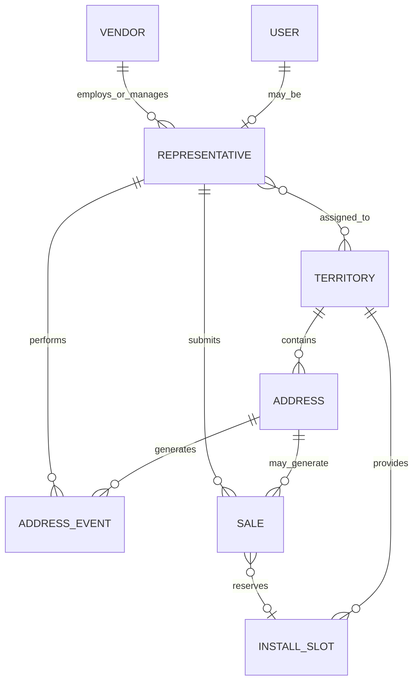
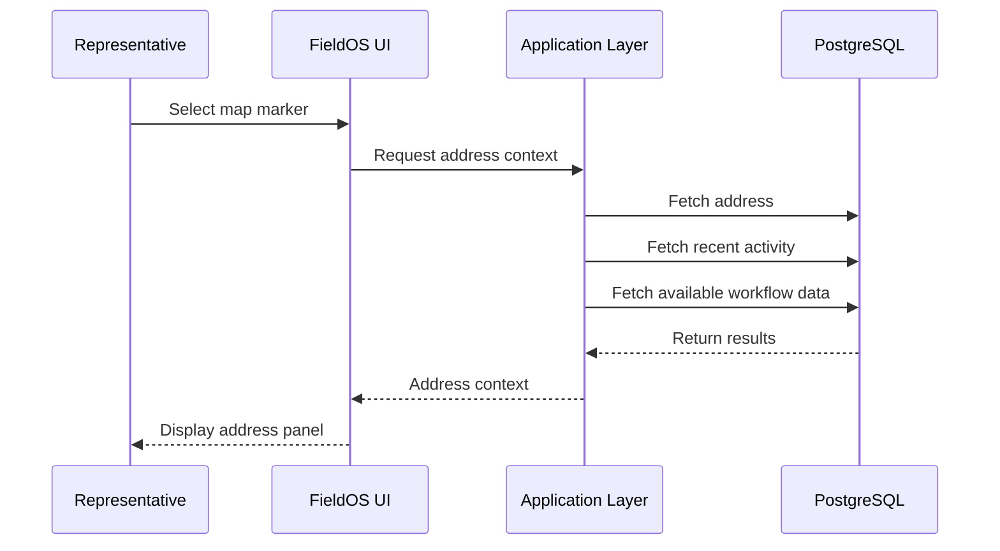
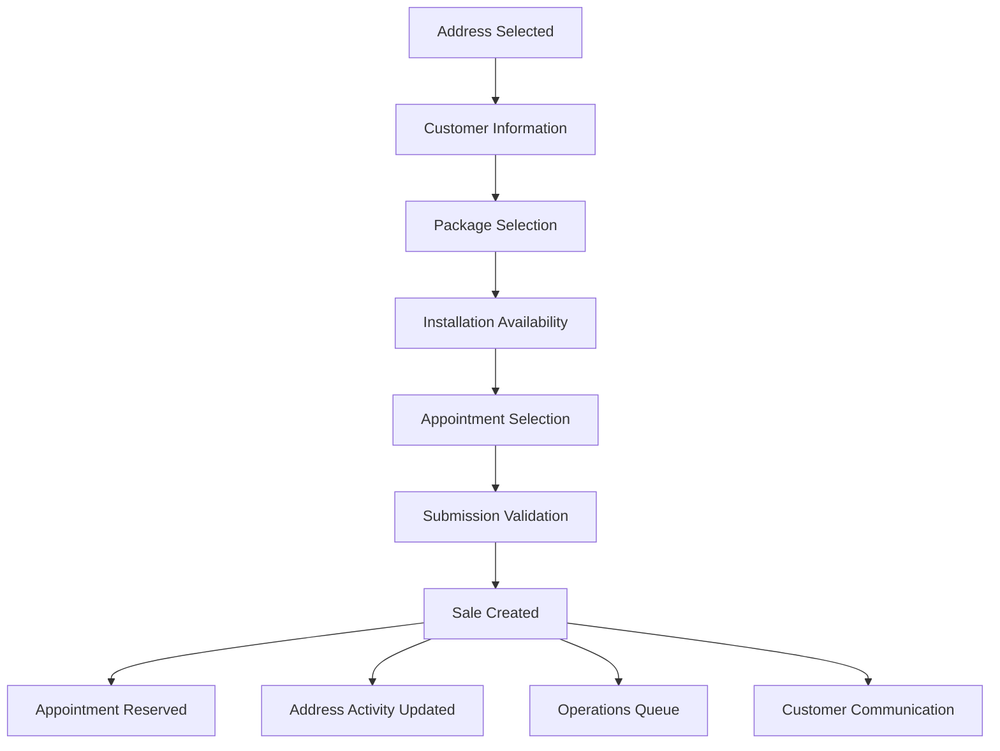
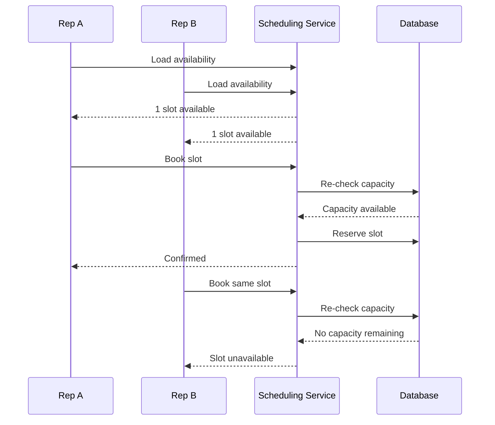
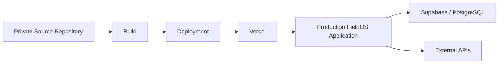
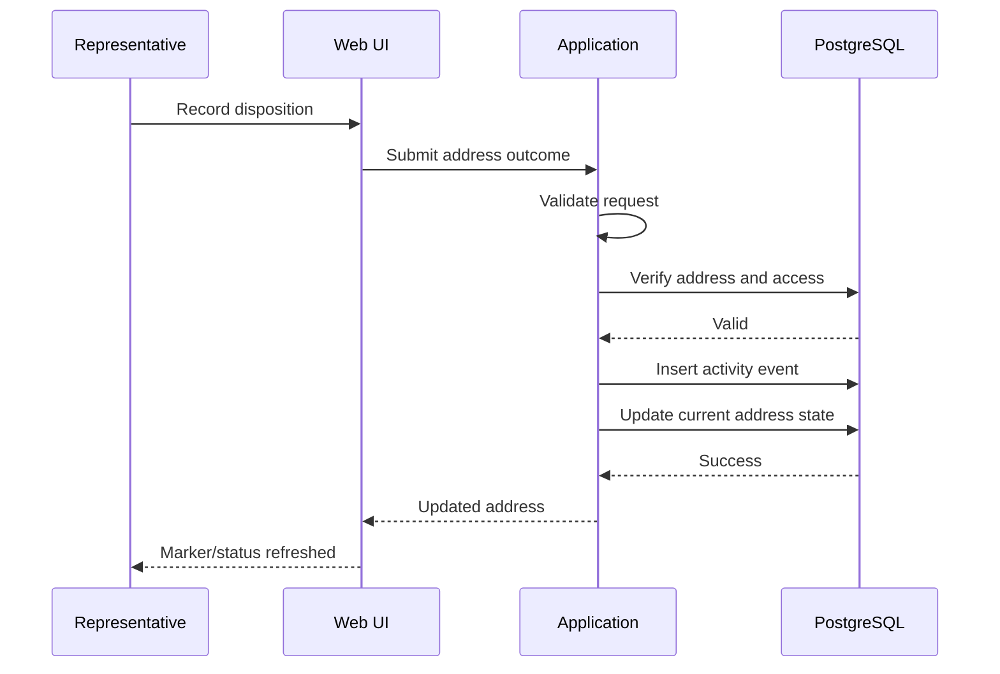
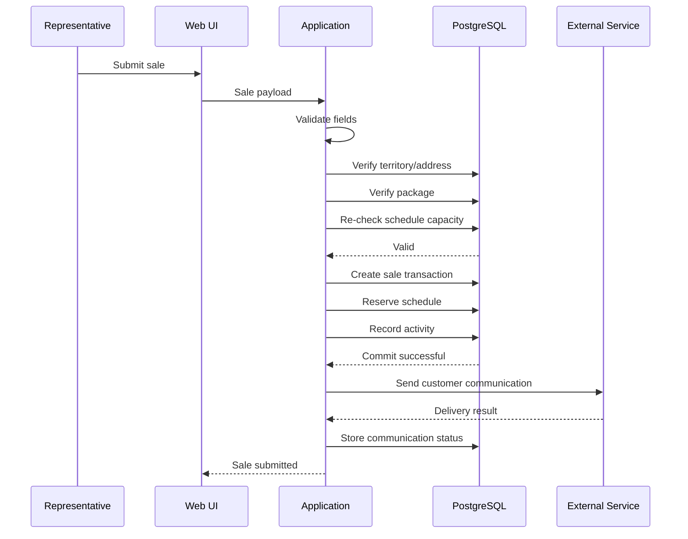
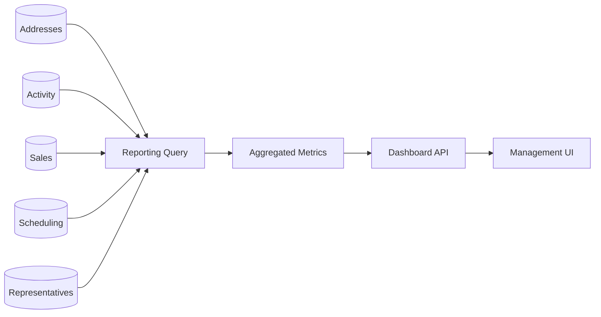
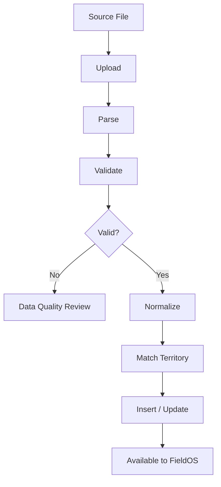

# FieldOS Technical Overview

## Introduction

FieldOS is a production field-sales operations platform built to support the full lifecycle of door-to-door sales activity, from territory assignment and address-level canvassing through sales submission, installation scheduling, operational review, invoicing, reporting, and management oversight.

The application was designed around a practical business requirement: field representatives, operations teams, vendors, and management needed a shared system of record rather than a collection of disconnected spreadsheets, manual processes, and one-off reporting workflows.

This document focuses on the technical implementation and engineering decisions behind the platform.

It is intentionally written at a level suitable for a public portfolio. Production credentials, private endpoints, proprietary business rules, exact production schemas, internal identifiers, and sensitive company configuration are excluded.

---

# 1. Technology Stack

FieldOS uses a modern web application stack centered around TypeScript, PostgreSQL, Supabase, and Vercel.

## Core Technologies

| Layer | Technology | Primary Responsibility |
|---|---|---|
| Front End | TypeScript / JavaScript | User interface, client-side workflows, form handling, map interaction |
| Styling | HTML / CSS | Responsive layouts, dashboards, operational interfaces |
| Application Layer | TypeScript / JavaScript | Request handling, validation, workflow coordination, API communication |
| Database | PostgreSQL | Transactional data, operational state, reporting data |
| Database Logic | SQL / PLpgSQL | Business rules, reporting queries, controlled data operations |
| Backend Services | Supabase | Managed PostgreSQL and application services |
| Hosting | Vercel | Application hosting and deployment |
| Integrations | REST APIs | Communications, data exchange, supporting workflows |
| Geospatial Data | Address coordinates / territory boundaries | Mapping, territory access, field navigation |

The application is designed so each layer has a clear responsibility rather than placing all logic in the browser or all logic in the database.

---

# 2. Application Design Philosophy

FieldOS was built around operational workflows rather than database tables.

A representative does not think in terms of:

- address records
- event records
- scheduling rows
- sales rows
- status tables
- reporting queries

A representative thinks:

> Which doors should I work today?

An operations employee thinks:

> Which sales need attention?

A manager thinks:

> How is the program performing?

The application translates these business questions into structured technical workflows.

This distinction shaped much of the implementation.

---

# 3. Major Functional Domains

The platform can be divided into several technical domains.

## Field Operations

Responsible for:

- territory assignment
- address retrieval
- field activity
- address dispositions
- follow-up tracking
- representative activity

## Mapping

Responsible for:

- territory boundaries
- address coordinates
- map markers
- field status visualization
- map-based address selection

## Sales Processing

Responsible for:

- customer information
- package selection
- sales submission
- sale status
- downstream operational processing

## Scheduling

Responsible for:

- installation dates
- appointment windows
- territory capacity
- booking availability
- overbooking prevention

## Operations

Responsible for:

- sales review
- installation outcomes
- reschedules
- cancellations
- invoicing
- clawbacks
- exception management

## Reporting

Responsible for:

- representative metrics
- team performance
- territory performance
- vendor performance
- installation outcomes
- management KPIs
- historical reporting

## Administration

Responsible for:

- users
- representative status
- territory assignments
- vendors
- imports
- data quality
- audit history
- configuration

---

# 4. Front-End Implementation

The FieldOS interface is built as a browser-based application.

The front end is responsible for presenting the correct tools to each user and coordinating user actions with server-side services.

## Representative Interface

The representative-facing experience is optimized for field use.

Typical interactions include:

1. Sign in
2. Load assigned territories
3. Open the territory map
4. Select an address
5. Review previous activity
6. Record an outcome
7. Enter customer information if a sale occurs
8. Select an available service package
9. Review installation availability
10. Submit the sale

The interface is designed to minimize unnecessary navigation during this process.

---

## Operations Interface

Operations users receive interfaces designed around queues and exceptions rather than field activity.

Typical functions include:

- reviewing submitted sales
- identifying records requiring action
- updating installation outcomes
- reviewing reschedules
- managing cancellations
- preparing invoicing
- reviewing historical records

This allows operational teams to work from controlled workflows rather than directly editing raw database records.

---

## Management Interface

Management dashboards aggregate transactional data into business-level views.

The interface includes:

- KPI cards
- filters
- trend charts
- representative comparisons
- territory comparisons
- team comparisons
- installation metrics
- activity metrics
- follow-up opportunities

The same underlying operational data powers both the field workflow and management reporting.

---

# 5. Component Design

The user interface is organized into reusable functional components rather than a single large application page.

Conceptually, components include:

```text
Application Shell
│
├── Authentication
│
├── Navigation
│
├── Dashboard Components
│   ├── KPI Cards
│   ├── Filters
│   ├── Charts
│   └── Summary Tables
│
├── Territory Map
│   ├── Boundary Layer
│   ├── Address Markers
│   ├── Marker Status
│   └── Address Detail Panel
│
├── Sales Workflow
│   ├── Customer Form
│   ├── Package Selection
│   ├── Scheduling
│   └── Submission
│
├── Operations
│   ├── Sales Queue
│   ├── Review Actions
│   └── Invoice Workflow
│
└── Administration
    ├── Users
    ├── Territories
    ├── Imports
    └── Data Quality
```

This separation improves maintainability and makes it easier to add features without redesigning unrelated areas of the application.

---

# 6. Database Design

PostgreSQL is the primary source of truth for operational data.

The database is relational because FieldOS contains strongly related entities such as:

- representatives
- territories
- addresses
- address activity
- sales
- scheduling
- vendors
- users
- operational statuses

A relational model makes these relationships explicit and queryable.

---

# 7. Conceptual Data Model

The production database contains additional implementation detail, but a simplified public model looks like:



The actual system includes additional relationships and operational metadata that are intentionally omitted here.

---

# 8. Address-Centered Data Model

The address is the central object in the field-sales workflow.

An address can be associated with:

- geographic coordinates
- territory
- current field status
- historical activity
- representative interactions
- notes
- follow-up state
- one or more sales-related events

This design provides a consistent anchor across mapping, canvassing, sales, reporting, and operations.

---

# 9. Current State vs. Historical State

A key implementation decision was separating the current state of an address from its activity history.

For example:

```text
Address
├── Current disposition
├── Current follow-up status
├── Current territory
└── Historical events
    ├── Event 1
    ├── Event 2
    ├── Event 3
    └── Event 4
```

This avoids losing history whenever the latest status changes.

It also allows reporting to answer questions such as:

- How many doors did a representative work?
- How many times was an address visited?
- What happened before a sale occurred?
- When was the last interaction?
- Which addresses require follow-up?

---

# 10. Event-Driven Activity Tracking

Field activity is modeled as events rather than only as mutable status fields.

Examples of events can include:

- address visited
- disposition recorded
- note added
- sale submitted
- status changed
- follow-up created

Conceptually:

```text
event {
    address
    representative
    event_type
    timestamp
    metadata
}
```

This provides a usable operational history while allowing the application to separately maintain a fast current-state representation.

---

# 11. Territory Assignment Logic

FieldOS controls which geographic data a representative can work.

The basic relationship is:

```text
Representative
      ↓
Territory Assignment
      ↓
Authorized Territory
      ↓
Addresses
```

The system uses territory assignments to determine which address records should be presented to each field user.

This avoids loading the complete company address inventory for every representative.

---

# 12. Geospatial Data

FieldOS uses geographic information for both territory definition and address-level field operations.

The system works with:

- latitude
- longitude
- territory boundaries
- imported boundary files
- address points

These elements are combined in the user interface to produce the interactive territory map.

---

# 13. Map Rendering Strategy

The mapping interface combines two major data types:

## Territory Geometry

Used to show the geographic area assigned to a representative or team.

## Address Points

Used to show individual serviceable locations.

Each address marker can carry application state such as:

- unworked
- previous attempt
- follow-up
- sale
- other disposition

This allows the map itself to function as an operational interface rather than simply a geographic reference.

---

# 14. Address Selection Workflow

When a representative selects an address, the application retrieves the operational context required to work that location.

Conceptually:



The representative does not need to manually search multiple systems for that information.

---

# 15. Disposition Workflow

When a representative records an address outcome, the application performs more than a simple text update.

Conceptually, the workflow may include:

1. Validate user access
2. Validate address
3. Validate disposition value
4. Record activity event
5. Update current address state
6. Save notes or metadata
7. Recalculate relevant reporting data
8. Return the updated state

This keeps current-state and historical data synchronized.

---

# 16. Sales Submission Workflow

The sales workflow connects several domains that would otherwise be independent.



A successful submission can therefore create or update multiple related pieces of operational state.

---

# 17. Form Validation

FieldOS uses validation to prevent incomplete or inconsistent operational records.

Validation may occur at multiple levels.

## Client-Side Validation

Used for fast user feedback, such as:

- required fields
- valid selections
- formatting
- missing information

## Application Validation

Used for business rules, such as:

- user authorization
- valid territory
- valid package
- required sale information
- valid workflow state

## Database Validation

Used for data integrity, such as:

- relational constraints
- required values
- controlled updates
- transactional consistency

No single validation layer is treated as the only protection.

---

# 18. Database Functions and Business Logic

SQL and PLpgSQL are used where business logic benefits from being close to the data.

This is useful for operations that require:

- multiple database writes
- consistent state transitions
- server-side validation
- aggregation
- transactional behavior

Rather than allowing the browser to independently update several related records, a controlled server-side operation can perform the complete workflow.

---

# 19. Transactional Operations

Some workflows require multiple changes to succeed or fail together.

For example, submitting a sale may conceptually involve:

```text
BEGIN

Validate sale
Validate appointment capacity
Create sale
Reserve appointment
Update address activity
Record status

COMMIT
```

If a critical operation fails, the transaction can be rolled back rather than leaving the system partially updated.

This is especially important in scheduling and sales processing.

---

# 20. Installation Scheduling

Installation scheduling is one of the most technically sensitive parts of the platform because multiple users can interact with the same capacity simultaneously.

Availability is determined by several dimensions:

```text
Territory
+
Date
+
Appointment Window
+
Configured Capacity
-
Existing Reservations
=
Available Capacity
```

The application does not treat a displayed appointment as permanently available.

---

# 21. Concurrency Protection

Consider two representatives viewing the same installation slot.

```text
Representative A sees 1 slot
Representative B sees 1 slot
```

Both screens may be technically correct at the moment they load.

If Representative A books the slot first, Representative B's previously displayed information becomes stale.

FieldOS therefore revalidates the selected slot at submission time.



This prevents stale browser state from being treated as authoritative.

---

# 22. Capacity Management

Scheduling capacity is centrally managed rather than hard-coded into individual user interfaces.

This makes it possible to adjust operational capacity without rebuilding each representative workflow.

Capacity can conceptually vary by:

- territory
- day
- appointment window
- operational policy

This model also supports reporting on:

- open capacity
- used capacity
- utilization
- scheduling pressure

---

# 23. Package Availability

Available service packages can vary by market or territory.

FieldOS therefore treats product availability as contextual rather than displaying every package to every representative.

Conceptually:

```text
Selected Address
      ↓
Territory / Market
      ↓
Eligible Service Options
      ↓
Representative Selection
```

This reduces invalid package selections and simplifies the field workflow.

---

# 24. Sales Review Workflow

Submitted sales enter an operational review process.

The review interface allows operations staff to manage the lifecycle without editing raw database rows.

Conceptual states include:

```text
Submitted
    ↓
Pending Installation
    ↓
Installed
    ↓
Invoice Ready
    ↓
Invoiced
```

Alternative paths can include:

```text
Submitted
    ↓
Rescheduled
```

or:

```text
Submitted
    ↓
Cancelled
```

The production workflow contains additional detail not included in this public document.

---

# 25. Invoicing Workflow

The invoicing process is connected to operational sale status.

Rather than treating every submitted sale as invoiceable, the system can identify which sales have reached the appropriate lifecycle state.

This reduces manual reconciliation between:

- sales activity
- installation results
- invoices

The interface can also support exporting selected operational records for downstream processes.

---

# 26. Cancellation and Reschedule Handling

Cancellations and reschedules are maintained as operational states rather than deleting the original sale.

This is important because deleting records would remove historical context.

Preserving those outcomes supports:

- accurate reporting
- reconciliation
- vendor review
- rep performance analysis
- historical audits

---

# 27. Clawback / Credit Handling

Field sales programs can require adjustments when a previously qualified sale later changes status.

FieldOS includes operational support for tracking these downstream adjustments.

The technical goal is to preserve both:

- the original sale
- the subsequent adjustment

rather than rewriting history.

---

# 28. Reporting Data

Reporting is derived from operational system data.

This means dashboards can combine information from:

- addresses
- field activity
- sales
- representatives
- territories
- vendors
- scheduling
- installations
- invoice status

The platform does not require a separate spreadsheet to calculate every core KPI.

---

# 29. Reporting Query Design

Reporting queries are designed around business questions.

For example:

```text
How many doors were worked?
How many sales were submitted?
How many were installed?
What is the close rate?
Which territories are performing best?
Which representatives require follow-up?
How much installation capacity remains?
```

SQL aggregation is used to transform transactional records into these higher-level metrics.

---

# 30. KPI Calculation

Conceptually, a metric such as close rate may be calculated from operational data:

```text
Qualified Sales
--------------
Worked Addresses
```

The exact production definition depends on business rules and is intentionally omitted.

The important technical principle is that KPI definitions are centralized rather than independently recreated in every dashboard component.

---

# 31. Management Dashboards

Management dashboards combine multiple data sources into a single operational view.

Examples of dashboard elements include:

- sales totals
- installed sales
- field activity
- close rates
- representative rankings
- territory performance
- team performance
- installation capacity
- follow-up opportunities
- historical trends

Filtering allows management to move between company-level and narrower operational views.

---

# 32. Filtering Strategy

Common filters can include:

- date range
- team
- vendor
- territory
- representative
- operational status

Filtering is handled as part of the reporting query rather than requiring users to export data and manually filter spreadsheets.

---

# 33. Historical Reporting

The event-based data model supports reporting across time.

Instead of only showing current status, FieldOS can evaluate:

- activity during a date range
- sales submitted during a period
- installation outcomes
- representative trends
- territory trends

This creates a more reliable historical view than attempting to reconstruct history from mutable current-state fields.

---

# 34. Vendor and Team Reporting

FieldOS supports environments where multiple teams or external vendors participate in field sales.

This requires separating:

- company-level performance
- vendor-level performance
- team-level performance
- representative-level performance

The relational data model allows reporting to aggregate at each level.

---

# 35. Authentication

FieldOS requires authenticated access.

Authentication is handled separately from normal application data.

After authentication, the application determines what the user is authorized to access.

Authentication answers:

> Who is this user?

Authorization answers:

> What is this user allowed to do?

These are treated as separate concerns.

---

# 36. Authorization

Access can depend on concepts such as:

- role
- representative identity
- team
- territory assignment
- administrative permission

For example:

```text
Representative
    → assigned territory data

Operations
    → sales workflow data

Management
    → aggregate reporting

Administrator
    → configuration and administration
```

This reduces unnecessary access and helps keep the application interface focused.

---

# 37. Administrative Tools

FieldOS includes dedicated administration workflows rather than requiring routine configuration changes through SQL.

Administrative tools can support:

- user access
- representative activation
- territory assignments
- vendor configuration
- data imports
- data quality review
- audit history

This allows operational administration without exposing direct database access.

---

# 38. Data Import Workflows

FieldOS supports large datasets such as address inventories and territory information.

Import processes are designed to validate incoming data before it is treated as production operational data.

Common validation concerns include:

- required fields
- duplicate records
- territory relationships
- coordinate validity
- formatting
- address normalization
- identifier consistency

---

# 39. Address Data Quality

Address datasets can contain inconsistencies.

The application therefore separates import processing from the representative workflow.

Potential quality checks include:

- malformed address fields
- missing coordinates
- duplicate locations
- invalid territory relationships
- unexpected status values

This prevents raw source data problems from immediately affecting field users.

---

# 40. Territory Boundary Imports

Territory definitions may originate from external geospatial files.

The system supports storing and associating territory boundary information with operational territories.

This data is then consumed by the mapping interface.

A simplified process is:

```text
Boundary File
     ↓
Validation
     ↓
Territory Association
     ↓
Stored Boundary Data
     ↓
Map Rendering
```

---

# 41. API Design

FieldOS uses APIs to separate browser behavior from server-side business operations.

Typical API responsibilities include:

- receiving user requests
- validating input
- checking authorization
- retrieving data
- invoking database operations
- calling external services
- returning structured responses

The browser does not need to know implementation details of every downstream service.

---

# 42. API Response Design

API responses are structured to communicate both success and actionable failure states.

For example:

```json
{
  "success": true,
  "result": {
    "status": "submitted"
  }
}
```

or conceptually:

```json
{
  "success": false,
  "error": {
    "code": "SLOT_UNAVAILABLE",
    "message": "The selected appointment is no longer available."
  }
}
```

Clear application-level error states allow the user interface to respond appropriately.

---

# 43. Error Handling

Operational applications must assume that failures will occur.

Potential failures include:

- invalid input
- database errors
- network interruption
- external API failure
- stale scheduling data
- authorization failure
- duplicate actions

FieldOS is designed to surface meaningful operational errors rather than silently failing.

---

# 44. Idempotency and Duplicate Prevention

Certain user actions should not create duplicate operational records if repeated.

For example, a user may:

- double-click a submit button
- refresh during a request
- retry after a network delay

For sensitive operations, the system can use controlled server-side logic and existing-state checks to reduce unintended duplication.

---

# 45. Customer Communications

Sales submission can trigger customer-facing communication workflows.

The communication system is separated from the user interface.

Conceptually:

```text
Sale Submitted
      ↓
Operational Record Created
      ↓
Communication Request
      ↓
Email Service
      ↓
Result Returned
      ↓
Delivery Status Stored
```

This allows the application to distinguish between:

- the sale succeeding
- the communication succeeding

These are not treated as the same event.

---

# 46. Notification Status Tracking

When an automated communication is attempted, its result can be stored.

Examples of states conceptually include:

- pending
- sent
- failed

This gives operations visibility into communication outcomes and makes retry or review workflows possible.

---

# 47. External Integrations

External services are treated as dependencies rather than core sources of truth.

FieldOS keeps primary operational state in its own database.

External services may be used for:

- notifications
- email
- reporting support
- mapping support
- scheduling synchronization
- data exchange

This reduces the risk of losing core business state if an external service is temporarily unavailable.

---

# 48. Deployment

The application is deployed through Vercel.

A typical deployment path is:



The public showcase repository is separate from the production repository.

---

# 49. Environment Variables

Sensitive configuration is not committed to the public repository.

Environment-specific values can include:

- database URLs
- API keys
- authentication secrets
- service credentials
- private endpoints

These values are managed through deployment configuration.

This keeps application code separate from secrets.

---

# 50. Development Environments

A production application benefits from separating development and production concerns.

Typical environment categories include:

```text
Local Development
      ↓
Testing / Preview
      ↓
Production
```

Environment-specific configuration prevents development changes from unintentionally targeting production services.

---

# 51. Database Migrations

Database changes are managed as versioned migrations rather than undocumented manual edits.

Migration-based changes provide:

- repeatability
- reviewability
- historical context
- safer deployment
- rollback planning

Examples of changes that belong in migrations include:

- new tables
- new columns
- indexes
- database functions
- constraints
- reporting structures

---

# 52. Rollback Planning

Schema and business-logic changes can affect production workflows.

For higher-impact changes, rollback planning is important.

The goal is to know:

> If this deployment creates a problem, how do we return the system to a safe state?

Rollback strategies may include:

- reversing a migration
- restoring a previous application deployment
- disabling a new feature
- reverting configuration

---

# 53. Testing Strategy

Testing focuses on business-critical workflows rather than only visual rendering.

Important test areas include:

- authentication
- territory access
- disposition recording
- sales submission
- scheduling
- overbooking prevention
- reporting calculations
- administrative workflows
- data imports

---

# 54. Unit-Level Testing

Smaller pieces of logic can be tested independently.

Examples include:

- parsing
- validation
- status transitions
- calculation functions
- transformation logic

These tests make it easier to identify failures before they reach full application workflows.

---

# 55. Integration Testing

Integration tests verify that multiple components work together.

Examples include:

```text
Sale submission
    +
Database write
    +
Schedule reservation
```

or:

```text
Address disposition
    +
Event history
    +
Current status
```

These tests are important because many FieldOS workflows span multiple data entities.

---

# 56. Workflow Testing

Some scenarios are best tested as complete workflows.

Example:

```text
Representative signs in
→ opens territory
→ selects address
→ records sale
→ selects install appointment
→ submits
→ operations sees sale
```

This validates the application from a user's perspective.

---

# 57. Scheduling Tests

Scheduling requires additional testing because of shared capacity.

Important cases include:

- available slot
- full slot
- simultaneous booking attempts
- invalid territory
- invalid date
- duplicate reservation
- schedule changes

Testing these cases reduces operational errors.

---

# 58. Reporting Validation

Reporting requires validating both queries and business definitions.

A dashboard can be technically functional while still presenting the wrong metric.

Reporting validation therefore asks:

- Are the correct records included?
- Are cancelled records excluded where appropriate?
- Is the date dimension correct?
- Are team totals reconcilable?
- Do detail records match summary totals?

---

# 59. Auditability

Operational history is important for troubleshooting.

FieldOS preserves enough history to investigate questions such as:

- Who worked this address?
- When did the status change?
- Who submitted the sale?
- What happened after submission?
- Why does a dashboard show this result?

Auditability reduces reliance on memory or external spreadsheets.

---

# 60. Administrative Audit Trail

Administrative actions can also require traceability.

Examples include:

- configuration changes
- territory assignment changes
- user changes
- administrative overrides

Maintaining an audit history provides context when reviewing unexpected behavior.

---

# 61. Performance Considerations

FieldOS handles datasets that can grow across:

- addresses
- address events
- sales
- territories
- representatives
- reporting history

Performance considerations include:

- limiting queries to the user's relevant scope
- indexing commonly filtered columns
- avoiding unnecessary full-table reads
- aggregating reporting data efficiently
- paginating large operational lists
- minimizing map payload size

---

# 62. Indexing Strategy

Indexes are useful for fields frequently used in:

- joins
- filters
- territory lookups
- representative lookups
- date filtering
- status filtering
- address retrieval

Index selection must balance faster reads against the cost of maintaining indexes during writes.

---

# 63. Query Scope

A representative generally does not require data for every company territory.

Scoping queries to relevant territories reduces:

- response size
- rendering time
- unnecessary database work
- unnecessary data exposure

This is especially important for map-based interfaces.

---

# 64. Dashboard Performance

Management dashboards often require expensive aggregations.

Performance can be improved through techniques such as:

- optimized SQL
- indexed filters
- pre-aggregated views where appropriate
- limiting date ranges
- loading detailed datasets only when needed

The goal is to provide useful reporting without forcing the browser to process raw operational datasets.

---

# 65. Map Performance

Maps can contain large numbers of address points.

Potential optimization strategies include:

- territory scoping
- filtered marker retrieval
- controlled payload sizes
- viewport-aware behavior
- minimizing unnecessary marker metadata

The application should retrieve enough information to support the current workflow without sending every available field for every address.

---

# 66. Security Principles

Security is treated as a layered concern.

Important principles include:

- authenticated access
- role-aware authorization
- territory-based scope
- server-side validation
- protected secrets
- controlled database operations
- minimal public exposure

---

# 67. Client Trust Boundary

The browser is not treated as a trusted source of business truth.

Values supplied by the client can be manipulated.

Therefore, sensitive operations are validated server-side.

Examples include:

- user identity
- territory access
- appointment availability
- sale state
- administrative operations

---

# 68. Secret Management

Secrets belong in protected environment configuration.

They do not belong in:

- public repositories
- screenshots
- README files
- browser-visible configuration
- committed source code

The public showcase intentionally excludes all production secrets.

---

# 69. Sensitive Data Handling

FieldOS can contain sensitive operational and customer data.

Examples include:

- names
- addresses
- phone numbers
- email addresses
- operational pricing
- internal identifiers
- vendor information

Public documentation therefore uses sanitized screenshots and conceptual examples.

---

# 70. Data Minimization

Interfaces should receive only the data required to perform the current workflow.

For example, a representative mapping interface does not need every administrative field associated with an address.

Reducing unnecessary data transfer improves both performance and privacy.

---

# 71. Production Logging

Operational applications require enough logging to diagnose failures.

Useful log context can include:

- operation type
- timestamp
- success/failure
- error category
- non-sensitive identifiers

Logs should avoid exposing secrets or unnecessary customer data.

---

# 72. Error Classification

Errors are more useful when they can be categorized.

Examples:

```text
VALIDATION_ERROR
AUTHORIZATION_ERROR
NOT_FOUND
SLOT_UNAVAILABLE
DATABASE_ERROR
INTEGRATION_ERROR
```

This makes it easier for both the interface and developers to determine the correct response.

---

# 73. Resilience to External Failure

An external email or integration failure should not automatically corrupt core application state.

For example:

```text
Sale creation = core transaction
Email confirmation = downstream integration
```

The application can record the communication failure separately and allow follow-up without deleting or recreating the sale.

---

# 74. Operational Source of Truth

A major design goal is for FieldOS to become the operational source of truth for the field-sales lifecycle.

That means avoiding situations where:

```text
Map says one thing
Spreadsheet says another
Sales report says another
Schedule says another
```

Connecting these workflows to shared data reduces reconciliation work.

---

# 75. Separation of Concerns

The system separates responsibilities across layers.

## UI

Responsible for:

- presentation
- interaction
- user feedback

## Application Logic

Responsible for:

- validation
- workflow coordination
- authorization checks
- API behavior

## Database

Responsible for:

- persistence
- relationships
- integrity
- transactions
- aggregation

## External Services

Responsible for:

- specialized supporting functions

This separation improves maintainability.

---

# 76. Why PostgreSQL

PostgreSQL is well suited to FieldOS because the platform requires:

- strong relational relationships
- transactions
- complex reporting
- historical data
- structured querying
- server-side functions
- constraints

It also supports the combination of transactional and analytical workloads needed for operational dashboards.

---

# 77. Why Supabase

Supabase provides a managed application layer around PostgreSQL.

For FieldOS, it reduces infrastructure overhead while still allowing direct use of PostgreSQL capabilities.

This makes it possible to use:

- relational data
- SQL
- database functions
- application authentication services
- managed hosting

without giving up database-level control.

---

# 78. Why TypeScript

TypeScript improves reliability in a workflow-heavy application.

Many FieldOS operations pass structured data such as:

```text
address
representative
territory
sale
appointment
status
report filters
```

Type definitions reduce ambiguity between application components and make refactoring safer as the platform grows.

---

# 79. Why Vercel

Vercel provides a deployment environment suited to a modern web application.

Benefits include:

- automated builds
- deployment previews
- environment configuration
- simple production deployment
- integration with source control

This allows application deployment to remain separate from database management.

---

# 80. Why SQL / PLpgSQL

Not every business operation belongs in application code.

SQL and PLpgSQL are useful where logic requires:

- transactional data updates
- complex aggregation
- relational validation
- multiple dependent writes
- reporting calculations

Moving appropriate logic closer to the data reduces unnecessary round trips and can improve consistency.

---

# 81. Example Technical Workflow: Door Knock

A simple field interaction can touch several technical layers.



The representative experiences this as one action, while the application preserves both current state and historical context.

---

# 82. Example Technical Workflow: Sale

A sale is more complex.



This illustrates how FieldOS coordinates multiple operational concerns through one user action.

---

# 83. Example Technical Workflow: Management Reporting



The dashboard is the presentation layer; the actual business metrics are built from underlying operational data.

---

# 84. Example Technical Workflow: Data Import



This keeps malformed source data away from representative-facing workflows.

---

# 85. Technical Challenges Solved

FieldOS required solving several problems that are common in production operational software.

## Shared Scheduling Capacity

Multiple representatives can compete for the same appointment inventory.

Solution:

- centralized capacity
- server-side validation
- re-check at commit time

## Historical Activity

Current status alone is not sufficient for field operations.

Solution:

- event history plus current state

## Role-Specific Access

Different users require different scopes and tools.

Solution:

- authenticated role-based workflows
- territory assignment controls

## Operational Reconciliation

Sales, installs, invoices, and cancellations must remain connected.

Solution:

- shared relational data model
- explicit lifecycle states

## Field Usability

Representatives need fast access while moving through territories.

Solution:

- map-centered workflow
- address-level actions
- reduced navigation

## Management Visibility

Leadership needs aggregated performance without manual spreadsheet reconciliation.

Solution:

- SQL-driven reporting
- shared operational source of truth
- management dashboards

---

# 86. Maintainability

FieldOS has evolved as operational requirements changed.

Maintainability is supported through:

- reusable UI components
- typed application data
- versioned migrations
- centralized database logic
- modular workflows
- controlled APIs
- clear domain separation

This makes it possible to add new operational requirements without rebuilding the system from scratch.

---

# 87. Extensibility

The current architecture can support future capabilities such as:

- additional sales teams
- additional territories
- new service packages
- expanded scheduling rules
- additional reporting
- new vendors
- additional integrations
- mobile-specific improvements

The relational and workflow-based design makes these extensions possible without changing the fundamental model.

---

# 88. Production Support

Building FieldOS also includes maintaining it after deployment.

Production support can involve:

- investigating application errors
- validating data
- adjusting operational workflows
- deploying fixes
- creating migrations
- reviewing reporting discrepancies
- refining interfaces based on user feedback
- responding to changing business requirements

This feedback loop has been an important part of the platform's development.

---

# 89. Technical Ownership

The project required work across multiple technical disciplines rather than a single isolated development task.

Responsibilities included:

- translating business requirements into workflows
- data modeling
- SQL development
- front-end development
- back-end/application logic
- API integration
- mapping workflows
- scheduling logic
- reporting
- deployment
- testing
- production troubleshooting
- continued feature development

---

# 90. Public Portfolio Scope

This technical overview intentionally demonstrates engineering depth without exposing proprietary implementation details.

Included:

- architectural concepts
- implementation patterns
- data relationships
- workflow design
- technology choices
- concurrency considerations
- reporting strategy
- deployment approach
- testing strategy
- security principles

Excluded:

- production credentials
- API keys
- exact production database schema
- internal URLs
- customer data
- vendor-confidential information
- private infrastructure details
- proprietary pricing logic
- company-specific operational rules

---

# 91. Summary

FieldOS is not simply a dashboard or a data-entry application.

It is an integrated operational platform that connects:

```text
Territories
      +
Addresses
      +
Field Representatives
      +
Customer Interactions
      +
Sales
      +
Scheduling
      +
Operations
      +
Reporting
      =
FieldOS
```

From a technical perspective, the project combines:

- TypeScript application development
- PostgreSQL relational modeling
- SQL and PLpgSQL
- API design
- transaction management
- concurrency handling
- geospatial workflows
- role-based access
- data imports
- operational reporting
- automated communications
- cloud deployment
- testing
- production support

The primary engineering objective has been to turn a complex field-sales operation into a consistent, traceable, and manageable software workflow while maintaining flexibility as the business process evolves.
