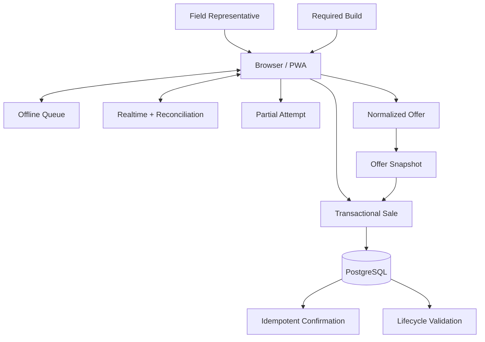

# FieldOS Public Code Examples

This folder contains simplified, sanitized examples based on implementation patterns used in the private FieldOS production application.

These examples are **not copies of production source code**. Names, schemas, values, endpoints, credentials, company-specific rules, and pricing have been changed or omitted. The purpose is to demonstrate the engineering decisions behind the system.

---

## [`transactional-sale-client.js`](transactional-sale-client.js)

Shows a client-side sale submission that treats the order, installation reservation, and activity event as one logical transaction.

**Concepts:**

- client-generated idempotency key,
- RPC/transaction boundary,
- authoritative transaction result,
- connectivity-aware retry,
- schedule reconciliation,
- saved pricing snapshot.

---

## [`offline-sync-queue.js`](offline-sync-queue.js)

Shows browser-local preservation and replay of field work during connectivity loss.

**Concepts:**

- local queue persistence,
- connectivity classification,
- sequential replay,
- retry metadata,
- post-sync reconciliation,
- distinction between network and database errors.

---

## [`realtime-schedule-sync.js`](realtime-schedule-sync.js)

Shows Realtime as the primary notification path with polling/focus/reconnect recovery.

**Concepts:**

- Supabase Realtime,
- debounced refresh,
- serialized reconciliation,
- polling fallback,
- mobile visibility handling.

---

## [`pricing-offer-snapshot.js`](pricing-offer-snapshot.js)

Shows how one normalized offer can drive the representative price breakdown, persisted historical snapshot, and customer confirmation.

**Concepts:**

- phased pricing,
- phased recurring/equipment charges,
- display/calculation consistency,
- immutable order snapshot,
- historical pricing integrity.

---

## [`partial-sale-capture.js`](partial-sale-capture.js)

Shows how incomplete customer interactions can be autosaved and later abandoned or converted without inflating completed-sale metrics.

**Concepts:**

- local draft state,
- debounced persistence,
- progress stages,
- separate partial-attempt model,
- conversion correlation.

---

## [`sale-confirmation-webhook.js`](sale-confirmation-webhook.js)

Shows an idempotent server-side customer confirmation workflow.

**Concepts:**

- webhook-secret validation,
- conditional delivery reservation,
- duplicate-send prevention,
- persisted order reload,
- `offer_snapshot` pricing source,
- SMTP delivery-state tracking.

---

## [`pwa-update-coordinator.js`](pwa-update-coordinator.js)

Shows how a field PWA can coordinate a required build without destroying unsynced work or entering an infinite reload loop.

**Concepts:**

- required-build marker,
- pending-work deferral,
- session reload guard,
- partial-deployment recovery,
- version convergence.

---

## [`lifecycle-validation.sql`](lifecycle-validation.sql)

Shows a validation-first view that compares operational sale state to a downstream lifecycle feed without immediately granting that feed mutation authority.

**Concepts:**

- stable external location ID,
- expected vs. observed state,
- match/mismatch classification,
- downstream exception handling,
- controlled automation boundary.

---

## [`schedule-reconciliation-audit.sql`](schedule-reconciliation-audit.sql)

Shows an audit-only integration pattern for an external scheduling source.

**Concepts:**

- proposed-action classification,
- capacity snapshots,
- source payload retention,
- match/ambiguity states,
- RLS/service-role boundary,
- audit before mutation.

---

## Architecture Represented

